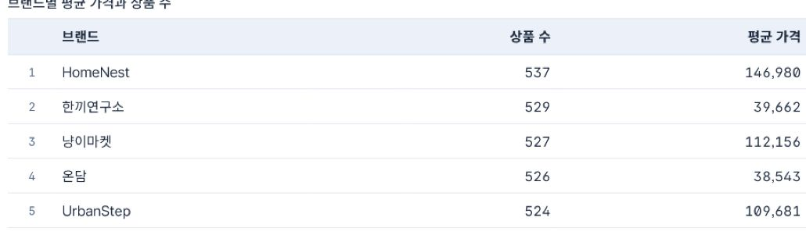

# Day 4 차트 완성형 한눈에 보기

이 문서는 “어떤 그래프를 만들었는지 기억이 안 날 때” 확인하는 빠른 색인입니다. 실제 클릭 순서는 [`KIBANA_9_5_STEP_BY_STEP.md`](KIBANA_9_5_STEP_BY_STEP.md)를 따릅니다.

## 공통 Dashboard 완성 예시

## 필수 패널 빠른 표

| 완성 패널 | 질문 | Lens 설정 | 상세 절차 |
|---|---|---|---|
| 전체 상품 수 Metric | 전체 상품은 몇 개인가? | Metric / Count of records | [5절](KIBANA_9_5_STEP_BY_STEP.md#5-패널-1--전체-상품-수-metric) |
| category Bar | 카테고리별 상품 수는? | Bar / category Top values 8 / Count | [6절](KIBANA_9_5_STEP_BY_STEP.md#6-패널-2--카테고리별-상품-수-bar) |
| brand Table | 브랜드별 수와 평균 가격은? | Table / brand / Count / Average price | [7절](KIBANA_9_5_STEP_BY_STEP.md#7-패널-3--브랜드별-상품-수와-평균-가격-table) |
| price Bar | 가격은 어느 구간에 몰렸나? | Bar / price Intervals custom ranges / Count | [8절](KIBANA_9_5_STEP_BY_STEP.md#8-패널-4--가격-구간별-상품-수-bar) |
| in_stock Donut | 재고 상태 비율은? | Pie / in_stock Top 2 / Style에서 Donut hole | [9절](KIBANA_9_5_STEP_BY_STEP.md#9-패널-5--재고-상태-비율-donut) |
| created_at Line | 월별 상품 등록 분포는? | Line / created_at Date histogram / Minimum interval 1M | [10절](KIBANA_9_5_STEP_BY_STEP.md#10-패널-6--월별-상품-등록-분포-line) |
| category Control | 특정 카테고리만 보려면? | Control / category / Options list | [12절](KIBANA_9_5_STEP_BY_STEP.md#12-category-options-list-control) |

## 패널별 완성 모습

### Metric과 category Bar

### brand Table

### price custom ranges Bar

### in_stock Donut

`Donut`을 차트 목록에서 찾지 않습니다. `Pie → Style → Appearance → Donut hole` 순서로 만듭니다.

### created_at Line

시간 단위는 `Minimum interval`에 `1M`을 입력합니다. 이 차트는 판매 추세가 아니라 상품 등록 시점의 분포입니다.

### Options list와 Filter

## 선택 확장 패널

| 유형 | 이럴 때 사용 | 예제 설정 | 주의 |
|---|---|---|---|
| Gauge | 목표 범위 안에서 현재 평균이 어디인지 볼 때 | Average rating / min 0 / max 5 / goal 4.0 | 여러 그룹의 정확한 비교에는 부적합 |
| Heat map | 두 조건 조합에 데이터가 얼마나 몰렸는지 볼 때 | category × review_count ranges / Count | 지리 지도가 아님 |
| Treemap | 상위 그룹과 하위 그룹의 구성비를 볼 때 | category → brand / Count | 작은 사각형의 정확한 값 비교는 어려움 |
| Tag cloud | tag 빈도를 빠르게 탐색할 때 | tags Top values 20 / Count | 글자 크기로 정밀 비교하지 않음 |

상세 클릭 순서는 [선택 확장 패널](KIBANA_9_5_STEP_BY_STEP.md#16-선택-확장-패널)을 확인합니다.

## 이번 수업에서 외우지 않아도 되는 유형

Kibana 9.5.0 선택기에는 Area, Waffle, Region map, Mosaic도 있지만 Day 4 필수 실습에는 포함하지 않습니다. `Legacy Metric`은 새 실습에서 사용하지 않습니다. 모든 차트를 암기하기보다 `질문 → field → 계산 → 차트 → 검증` 순서를 기억합니다.
