# Kibana 9.5.0 Dashboard 실습 — 화면 그대로 따라 하기

이 문서는 강사 시연을 놓쳤거나 메뉴를 기억하지 못해도 `products` 20,000건으로 Day 4 실습을 처음부터 다시 만들 수 있게 작성한 학생용 정본입니다.

- 기준 버전: Elasticsearch 9.5.0 / Kibana 9.5.0
- 기준 index: `products`
- 기준 시간 field: `created_at`
- 기준 문서 수: 20,000
- 화면 확인일: 2026-09-03

Kibana 창 너비에 따라 `Add`가 바로 보이거나 `More` 안에 들어갈 수 있습니다. 번역 설정에 따라 일부 메뉴가 한글로 보일 수도 있습니다. 이 문서에서 말하는 버튼이 없으면 임의로 비슷한 버튼을 누르지 말고, 현재 단계 번호와 화면 캡처를 남깁니다.

## 0. 모든 실습의 공통 시작 상태

차트 값이 다를 때 index가 지워졌다고 판단하기 전에 다음 상태를 먼저 맞춥니다.

1. Data View가 `products` index를 바라보는지 확인합니다.
2. 시간 범위를 강사가 지정한 절대 범위로 맞춥니다.
   - 권장 입력 범위: `2025-08-27 00:00:00`부터 `2026-08-28 00:00:00`까지
   - 시차나 초 단위 경계로 마지막 문서가 빠지지 않게 데이터보다 조금 넓은 범위를 사용합니다.
   - PC와 Kibana의 시간대 표시가 다르면 최종 문서 수 20,000을 기준으로 확인합니다.
3. KQL 입력칸을 비웁니다.
4. 상단 filter pill을 모두 지웁니다.
5. Dashboard Control은 `Any`로 되돌립니다.
6. Discover에서 20,000건인지 확인합니다.

공통 기준값은 다음과 같습니다.

| 항목 | 기준값 |
|---|---:|
| 전체 문서 | 20,000 |
| `in_stock : false` | 3,001 |
| `in_stock : true` | 16,999 |
| category | 8개, 각 2,500 |

## 1. Data View 만들기 또는 기존 Data View 확인하기

### 1.1 Data View의 역할

Data View는 Kibana가 어떤 index의 field를 사용할지 알려 주는 연결 설정입니다. 데이터를 복사하거나 새 index를 만드는 기능이 아닙니다. 같은 `products`를 바라보는 Data View를 여러 개 만들 수 있지만, 수업에서는 혼동을 막기 위해 강사가 지정한 하나만 사용합니다.

### 1.2 새로 만드는 순서

1. 왼쪽 메뉴에서 `Stack Management`를 엽니다.
2. `Kibana` 영역의 `Data Views`를 선택합니다.
3. 오른쪽 위 `Create data view`를 누릅니다.
4. `Name`에 알아보기 쉬운 이름을 입력합니다. 예: `쇼핑몰 상품 데이터`
5. `Index pattern`에 `products`를 입력합니다.
6. 화면에 일치하는 source가 `products`인지 확인합니다.
7. `Timestamp field`에서 `created_at`을 선택합니다.
8. `Save data view to Kibana`를 누릅니다.

`products*`는 `products`로 시작하는 여러 index를 함께 포함할 수 있고, 쉼표로 여러 source를 지정할 수도 있습니다. 수업에서는 다른 index가 섞이지 않도록 정확히 `products`를 사용합니다.

### 1.3 이미 있다면 새로 만들지 않고 확인하기

1. `Stack Management → Data Views`에서 강사가 지정한 Data View를 엽니다.
2. index pattern이 `products`인지 확인합니다.
3. `created_at`, `category`, `brand`, `price`, `in_stock` field가 보이는지 확인합니다.
4. 화면에 보이는 Data View 이름이 교재 캡처와 달라도 index pattern이 `products`면 사용할 수 있습니다.

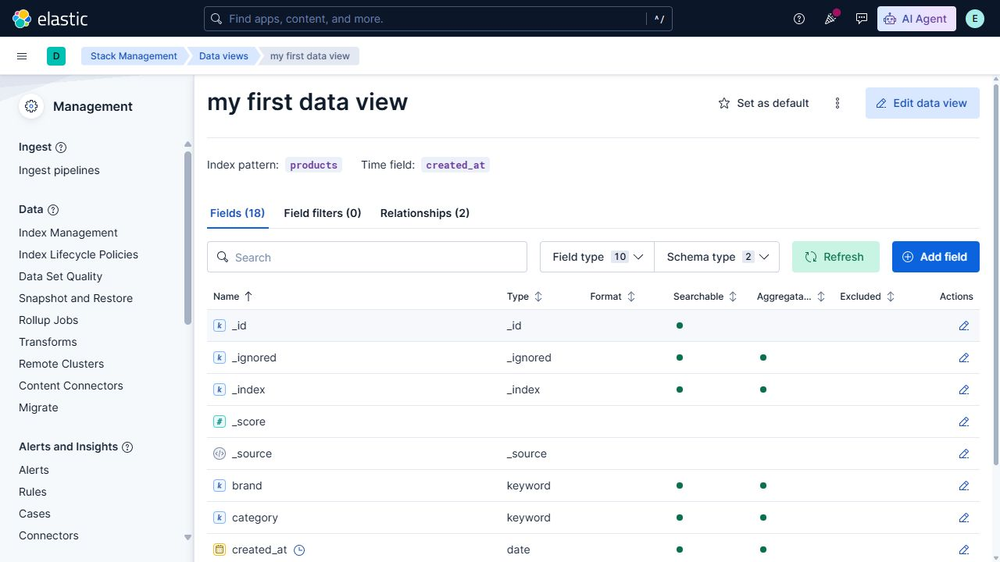

## 2. Discover에서 실제 데이터 확인하기

### 2.1 Discover의 역할

Discover는 실제 문서, field, 시간 범위, KQL 조건을 확인하는 화면입니다. 차트를 만들기 전에 데이터가 있는지, field 값이 어떤 모습인지, 현재 조건 때문에 일부만 보고 있지는 않은지 점검합니다.

### 2.2 20,000건과 열 7개 확인

1. 왼쪽 메뉴에서 `Discover`를 엽니다.
2. 화면 위 Data View 선택기에서 수업용 `products` Data View를 선택합니다.
3. 오른쪽 위 시간 선택기를 누릅니다.
4. `Absolute` 또는 `Custom range`에서 강사가 지정한 시작·종료 시각을 입력하고 적용합니다.
5. 결과가 20,000건인지 확인합니다.
6. 왼쪽 `Fields`에서 다음 field를 검색합니다.
   - `product_id`
   - `name`
   - `category`
   - `brand`
   - `price`
   - `in_stock`
   - `created_at`
7. 각 field 옆 `+` 또는 `Add field`를 눌러 표의 열로 추가합니다.
8. 표에 7개 열과 실제 값이 보이는지 확인합니다.

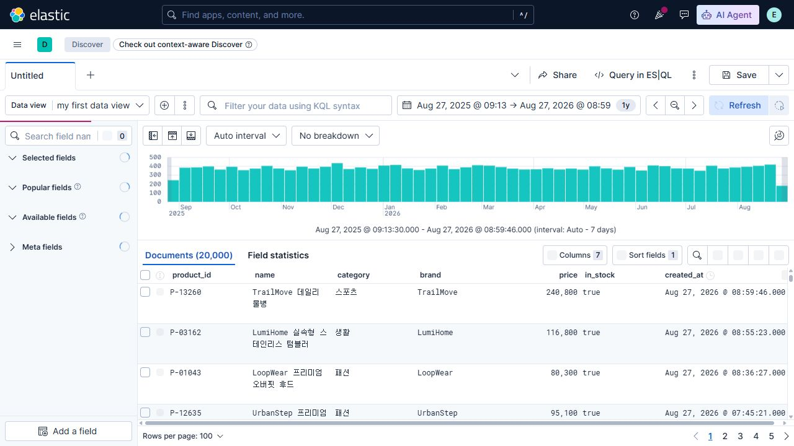

### 2.3 KQL 적용과 복구

1. 위쪽 `Filter your data using KQL syntax` 입력칸에 다음을 입력합니다.

   ```text
   in_stock : false
   ```

2. Enter를 누르거나 새로 고침해 3,001건인지 확인합니다.
3. 표의 `in_stock` 값이 `false`인지 확인합니다.
4. KQL을 전부 지우고 다시 실행합니다.
5. 20,000건으로 돌아왔는지 확인합니다.

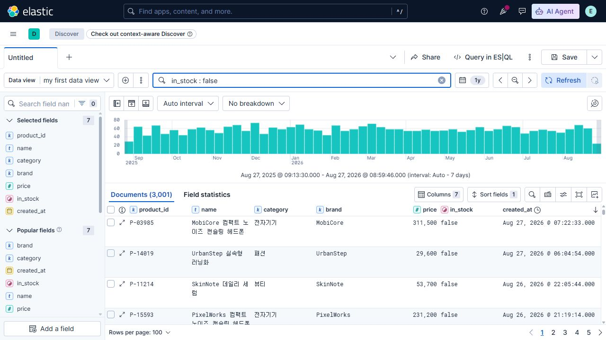

KQL은 데이터를 삭제하지 않습니다. 현재 화면에서 볼 문서만 제한합니다.

## 3. 빈 Dashboard 만들기

### 3.1 Dashboard의 역할

Dashboard는 Lens로 만든 여러 시각화와 Control을 한 화면에 배치해 조건을 바꾸며 함께 분석하는 공간입니다.

### 3.2 빈 Dashboard에서 첫 Lens 열기

1. 왼쪽 메뉴에서 `Dashboards`를 엽니다.
2. `Create dashboard`를 누릅니다.
3. 빈 화면에서 다음 큰 버튼을 누릅니다.
   - `Create visualization`
   - 설명: `Build charts, metrics, and tables with a point-and-click editor.`
4. Lens 편집기가 열리면 왼쪽 위 Data View가 수업용 `products`인지 확인합니다.

첫 패널을 만든 뒤에는 Dashboard 편집 화면의 `Add`를 누릅니다. 창이 좁아서 `Add`가 없다면 `More → Add`를 사용합니다. 이어서 `New → Visualization`을 선택합니다. 이번 수업에서는 `Visualization (query)`를 선택하지 않습니다.

## 4. Lens 공통 사용법과 저장 방식

### 4.1 Lens의 역할

Lens는 field, 계산 방식, 그룹 방식, 차트 종류를 선택해 시각화를 만드는 편집기입니다.

- 왼쪽: Data View와 field 목록
- 가운데: 결과 미리보기
- 오른쪽: 축, Metric, Rows, Slice 같은 설정
- 차트 아이콘: Bar, Line, Metric, Table, Pie 등 유형 변경

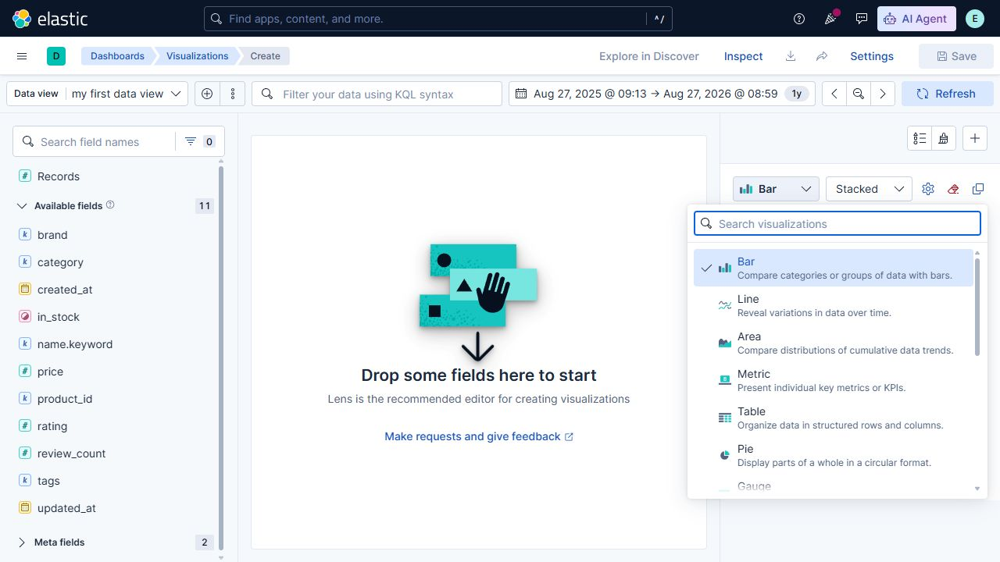

### 4.2 Dashboard에서 만든 패널 저장

1. Lens 설정과 결과를 확인합니다.
2. 오른쪽 위 `Save and return`을 누릅니다.
3. 현재 Dashboard로 돌아와 패널이 추가됐는지 확인합니다.

`Save and return`은 현재 Dashboard 안에 패널을 저장합니다. `Save to library`는 여러 Dashboard에서 재사용할 별도 Visualization을 저장하고 제목을 입력받습니다. 공통 실습은 `Save and return`을 사용합니다.

### 4.3 패널 제목 붙이기

`Save and return` 뒤 제목이 `Count of records`처럼 자동 표시되거나 비어 있을 수 있습니다.

1. Dashboard가 `Edit` 모드인지 확인합니다.
2. 패널 위에 마우스를 올립니다.
3. 패널 위쪽의 `Settings`를 누릅니다.
4. `Show title`을 켭니다.
5. `Enter a custom title for your panel`에 제목을 입력합니다.
6. `Apply`를 누릅니다.

## 5. 패널 1 — 전체 상품 수 Metric

1. 빈 Dashboard의 `Create visualization`을 누르거나 `Add → New → Visualization`을 엽니다.
2. 차트 유형에서 `Metric`을 선택합니다.
3. 왼쪽 field 목록의 `Records`를 눌러 workspace에 추가합니다.
4. 오른쪽 `Primary metric`이 `Count of records`인지 확인합니다.
5. 가운데 값이 20,000인지 확인합니다.
6. `Save and return`을 누릅니다.
7. 패널 `Settings`에서 제목을 `전체 상품 수`로 바꿉니다.

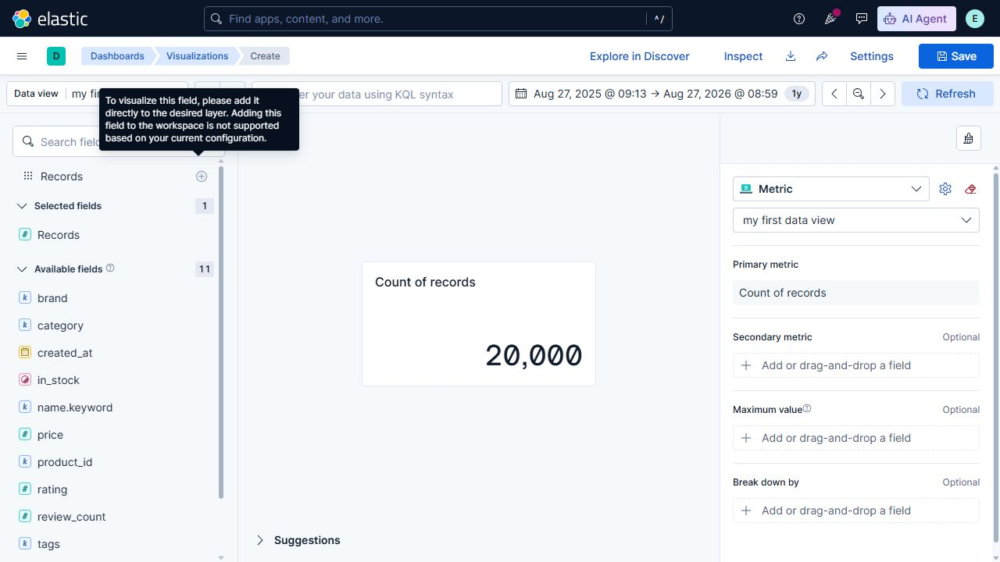

## 6. 패널 2 — 카테고리별 상품 수 Bar

1. Dashboard에서 `Add → New → Visualization`을 엽니다.
2. 차트 유형을 `Bar`로 선택합니다.
3. 오른쪽 `Horizontal axis`의 `Add` 또는 field 추가 영역을 누릅니다.
4. 그룹 방식에서 `Top values`를 선택합니다.
5. Field로 `category`를 선택합니다.
6. `Number of values`를 `8`로 입력합니다.
7. `Rank by`는 `Count of records`, `Rank direction`은 `Descending`으로 둡니다.
8. `Vertical axis`가 `Count of records`인지 확인합니다.
9. 8개 category가 각각 2,500인지 확인합니다.
10. `Save and return` 후 제목을 `카테고리별 상품 수`로 바꿉니다.

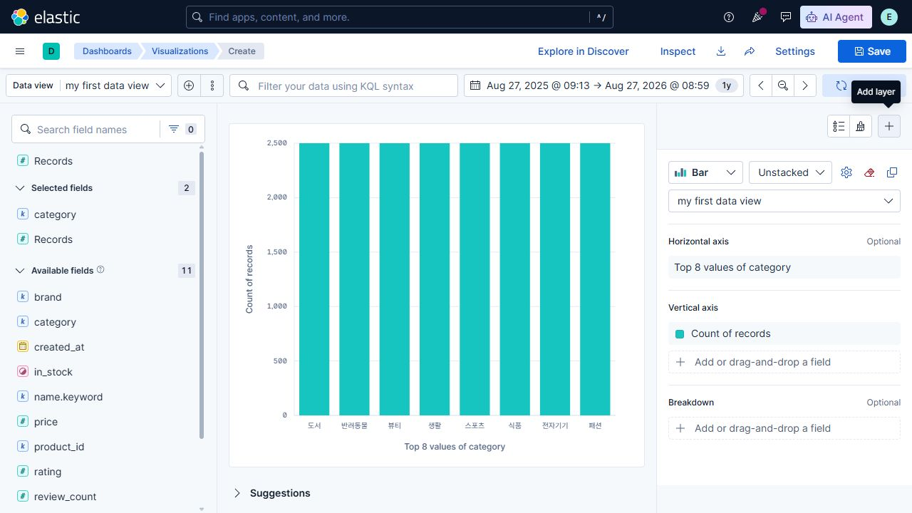

막대 방향은 축 label 방향이 아니라 `Style → Appearance → Bar orientation → Horizontal 또는 Vertical`에서 바꿉니다.

## 7. 패널 3 — 브랜드별 상품 수와 평균 가격 Table

1. `Add → New → Visualization`에서 차트 유형을 `Table`로 선택합니다.
2. 오른쪽 `Rows`의 field 추가 영역을 누릅니다.
3. `Top values`와 `brand`를 선택하고 `Number of values`를 `10`으로 둡니다.
4. Name을 `브랜드`로 입력합니다.
5. `Metrics`에 `Records`를 추가해 `Count of records`를 만듭니다.
6. Name을 `상품 수`로 입력합니다.
7. `Metrics`에 항목을 하나 더 추가합니다.
8. `Quick function → Average → Field: price`를 선택합니다.
9. Name을 `평균 가격`으로 입력합니다.
10. 표에서 브랜드, 상품 수, 평균 가격이 보이는지 확인합니다.
11. `Save and return` 후 제목을 `브랜드별 상품 수와 평균 가격`으로 바꿉니다.
12. Dashboard 표에서 정렬할 열 제목을 눌러 내림차순을 확인합니다.

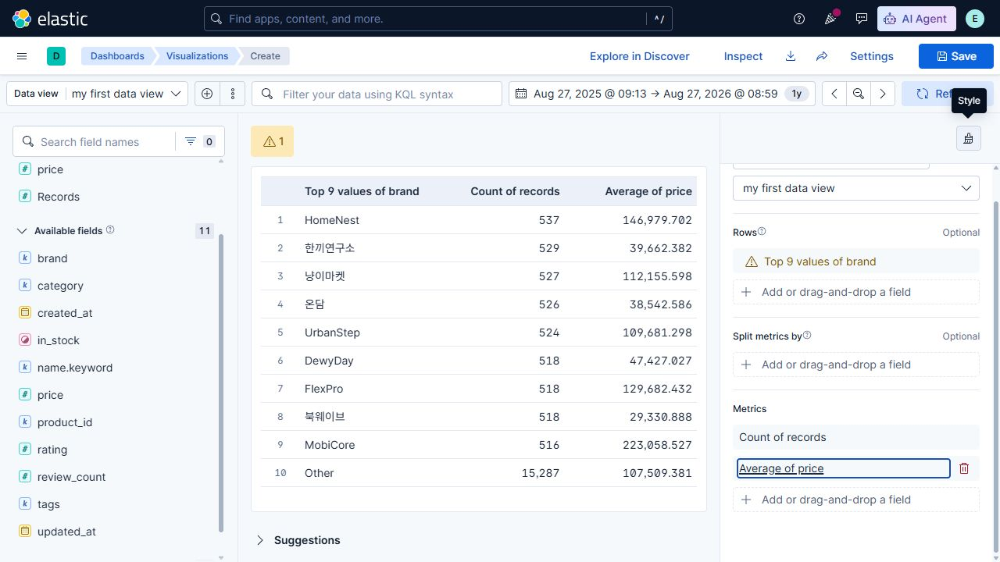

## 8. 패널 4 — 가격 구간별 상품 수 Bar

1. `Add → New → Visualization`에서 `Bar`를 선택합니다.
2. `Horizontal axis`에 항목을 추가합니다.
3. 그룹 방식으로 `Intervals`를 선택합니다.
4. Field는 `price`를 선택합니다.
5. `Create custom ranges`를 누릅니다.
6. 다음 범위를 각각 입력합니다. 경계는 `lower ≤ value < upper`입니다.
   - 0 이상 50,000 미만
   - 50,000 이상 100,000 미만
   - 100,000 이상 150,000 미만
   - 150,000 이상 200,000 미만
   - 200,000 이상
7. 필요하면 각 범위에 `Custom label`을 입력합니다.
8. `Vertical axis`는 `Count of records`로 둡니다.
9. 범위 사이에 빈틈이나 겹침이 없는지 확인합니다.
10. `Save and return` 후 제목을 `가격 구간별 상품 수`로 바꿉니다.

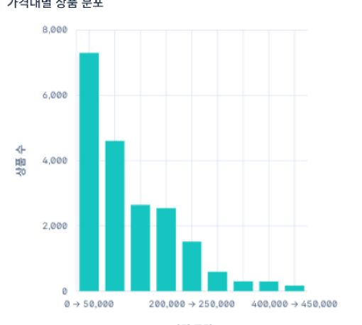

`Decrease granularity`와 `Increase granularity`는 자동 구간의 세밀함을 바꿀 뿐, 막대 수를 정확히 8~12개로 맞춰 주지 않습니다. 정확한 구간이 필요하면 `Create custom ranges`를 사용합니다.

## 9. 패널 5 — 재고 상태 비율 Donut

Kibana 9.5.0 차트 선택기에 `Donut`이라는 별도 유형은 없습니다. 먼저 `Pie`를 만들고 모양을 Donut으로 바꿉니다.

1. `Add → New → Visualization`에서 차트 유형을 `Pie`로 선택합니다.
2. 오른쪽 `Slice by`에 항목을 추가합니다.
3. `Top values`와 `in_stock`을 선택합니다.
4. `Number of values`를 `2`로 둡니다.
5. `Metric`이 `Count of records`인지 확인합니다.
6. `Style → Appearance → Donut hole`을 엽니다.
7. `Medium`을 선택합니다. `Small`이나 `Large`도 가능하지만 수업 기준은 Medium입니다.
8. 필요하면 `Titles and text → Slice values`에서 `Percentage` 또는 `Integer`를 선택합니다.
9. `true` 16,999, `false` 3,001, 합계 20,000인지 확인합니다.
10. `Save and return` 후 제목을 `재고 상태 비율`로 바꿉니다.

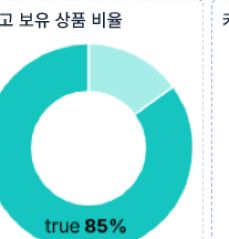

## 10. 패널 6 — 월별 상품 등록 분포 Line

1. `Add → New → Visualization`에서 `Line`을 선택합니다.
2. `Horizontal axis`에 항목을 추가합니다.
3. `Date histogram`을 선택합니다.
4. Field는 `created_at`을 선택합니다.
5. `Minimum interval`에 `1M`을 입력합니다.
6. `Vertical axis`는 `Count of records`로 둡니다.
7. 월 단위 점과 선이 보이는지 확인합니다.
8. `Save and return` 후 제목을 `월별 상품 등록 분포`로 바꿉니다.

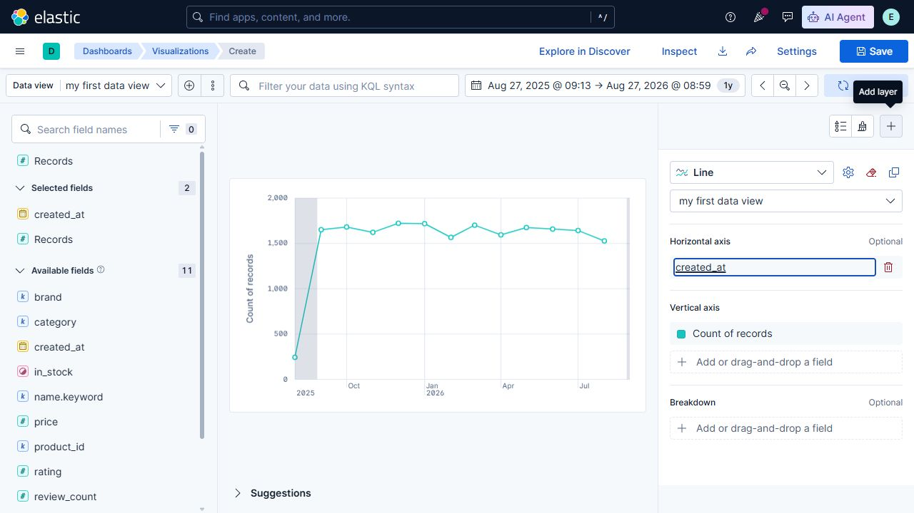

`created_at`은 상품 등록 시점입니다. 판매량, 매출, 주문 추세로 해석하면 안 됩니다. 판매 추세를 보려면 주문일과 판매 수량 또는 매출 같은 사건 데이터가 추가로 필요합니다.

## 11. Dashboard 배치·제목·패널 메뉴

### 11.1 배치와 크기

1. Dashboard 편집 모드에서 패널의 `Move panel` 영역을 끌어 위치를 바꿉니다.
2. 패널 모서리나 `Resize panel` 영역을 끌어 크기를 바꿉니다.
3. Metric은 작게, 비교 차트는 중간, 여러 열이 있는 Table은 넓게 둡니다.
4. 축 숫자나 label이 겹치면 먼저 패널 폭을 넓힙니다.

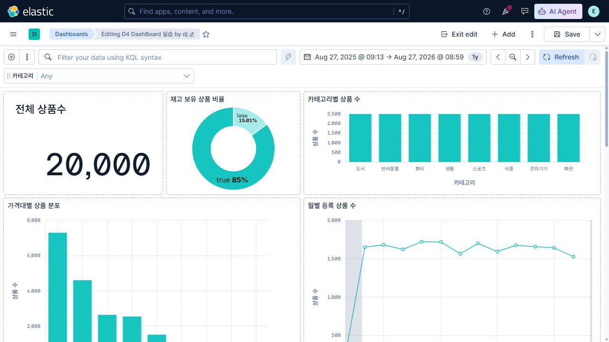

### 11.2 Panel menu에서 할 수 있는 일

편집 모드에서 패널에 마우스를 올리고 `Panel menu`를 엽니다.

- `Inspect`: 패널의 데이터와 요청을 확인
- `Download CSV`: 해당 패널의 데이터를 CSV로 내려받기
- `Duplicate`: 같은 패널 복제
- `Maximize`: 패널 크게 보기
- `Save to library`: 재사용할 Visualization으로 저장
- `Remove`: Dashboard에서 패널 제거

`Inspect`가 안 보이면 Dashboard가 보기 모드인지 먼저 확인하고 `Edit`로 들어간 뒤 패널의 `Panel menu`를 엽니다. Dashboard 위쪽 `More`에서 찾는 기능이 아닙니다.

## 12. category Options list Control

Control은 학생이 자주 바꿀 조건을 Dashboard 위에 입력 도구로 제공합니다.

1. Dashboard를 `Edit` 모드로 엽니다.
2. `Add`를 누릅니다. 버튼이 없으면 `More → Add`를 누릅니다.
3. `Add to dashboard` 창에서 `New` 탭을 선택합니다.
4. `Controls → Control`을 선택합니다.
5. `Select a field` 탭을 선택합니다.
6. Data View로 수업용 `products`를 선택합니다.
7. Field로 `category`를 선택합니다.
8. Control type은 `Options list`를 선택합니다.
9. Label에 `카테고리 선택`을 입력합니다.
10. 여러 값을 허용하려면 `Allow multiple selections`를, 하나만 허용하려면 `Only allow a single selection`을 선택합니다.
11. 검색 방식은 수업 기준으로 `Contains`를 선택합니다.
12. `Use global filters`와 `Validate user selections`가 켜져 있는지 확인합니다.
13. `Save`를 누릅니다.
14. Dashboard에서 category 하나를 선택하고 2개 이상의 패널이 함께 바뀌는지 확인합니다.
15. Control 값을 `Any`로 되돌리고 Metric이 20,000인지 확인합니다.

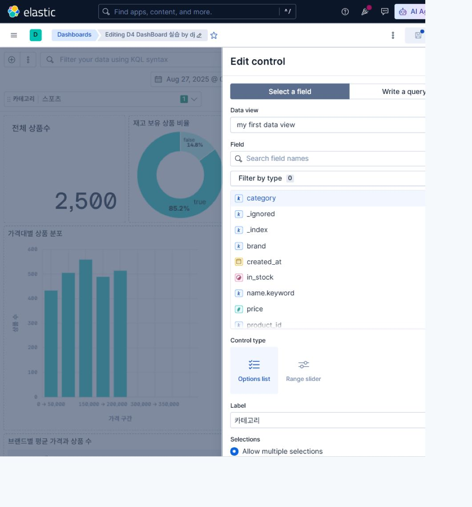

## 13. Control·Filter·KQL 사용과 복구

### 13.1 차이

| 기능 | 입력 위치 | 적합한 사용 |
|---|---|---|
| Control | Dashboard에 배치된 선택기 | 사용자가 자주 바꾸는 조건 |
| Filter | 위쪽 `Add filter` 또는 차트 클릭 | 특정 field 조건을 명시적으로 유지 |
| KQL | 위쪽 검색 입력칸 | 여러 조건을 빠르게 조합 |

### 13.2 막대를 클릭해 Filter 적용

차트의 막대나 Pie 조각을 클릭하면 버전에 따라 팝업이 뜨거나 곧바로 filter가 추가될 수 있습니다. `Filter for value`라는 문구가 반드시 나타나는 것은 아닙니다. 상단에 filter pill이 추가되고 여러 패널이 함께 바뀌는지 확인합니다.


### 13.3 Filter pill 해제

1. 상단 filter pill 옆의 `×`를 눌러 삭제합니다.
2. 또는 pill의 `Filter actions`를 열어 다음을 선택합니다.
   - `Temporarily disable`: 잠시 끄기
   - `Delete`: 삭제
   - `Exclude results`: 반대 조건으로 전환
3. Metric이 20,000으로 돌아왔는지 확인합니다.

### 13.4 Bar에 한 항목만 남았을 때

다음 순서로 한 항목씩 확인합니다.

1. 시간 범위가 공통 절대 범위인가?
2. Data View가 `products`인가?
3. KQL 입력칸이 비어 있는가?
4. 상단 filter pill이 남아 있는가?
5. category Control이 `Any`인가?
6. Lens의 축이 `category` Top values 8과 Count of records인가?

## 14. Dashboard 저장·재열기·복제

### 14.1 처음 저장

1. 현재 절대 시간 범위를 Dashboard와 함께 고정하려면 `More → Settings`를 엽니다.
2. `Store time with dashboard`를 켜고 `Apply`를 누릅니다.
3. 오른쪽 위 `Save`를 누릅니다.
4. Title에 `D4 공통 상품 Dashboard - 이름`을 입력합니다.
5. 설명은 선택 사항입니다.
6. 저장을 완료합니다.
7. Dashboards 목록으로 나갔다가 같은 제목을 다시 엽니다.
8. 6개 패널과 Control이 보이고 Metric이 20,000인지 확인합니다.

### 14.2 개인본 만들기

1. 공통 Dashboard를 엽니다.
2. `Save options → Save as`를 선택합니다.
3. Title을 `D4 개인 미션 - 주제 - 이름`으로 바꿉니다.
4. `Save`를 누릅니다.
5. Dashboard 목록에서 공통본과 개인본이 모두 있는지 확인합니다.

Kibana 9.5.0의 현재 수업 환경에서는 Save as 창이 아니라 Dashboard의 `More → Settings`에 `Store time with dashboard`가 있습니다. 저장 후 시간 범위를 다시 확인합니다.

## 15. 결과 저장·공유·백업

### 15.1 수업 제출의 기본 근거

Dashboard 제목, 시간 범위, Control/filter, 패널 제목과 값이 보이게 전체 화면을 캡처합니다. 개별 패널의 데이터가 필요하면 편집 모드의 `Panel menu → Download CSV`를 사용할 수 있습니다.

### 15.2 Dashboard JSON

수업 환경에서 Dashboard 오른쪽 위 `More → Export`를 열면 `Export dashboard as JSON`과 `Download JSON`이 제공됩니다. 이것은 현재 Dashboard의 기술용 JSON입니다.

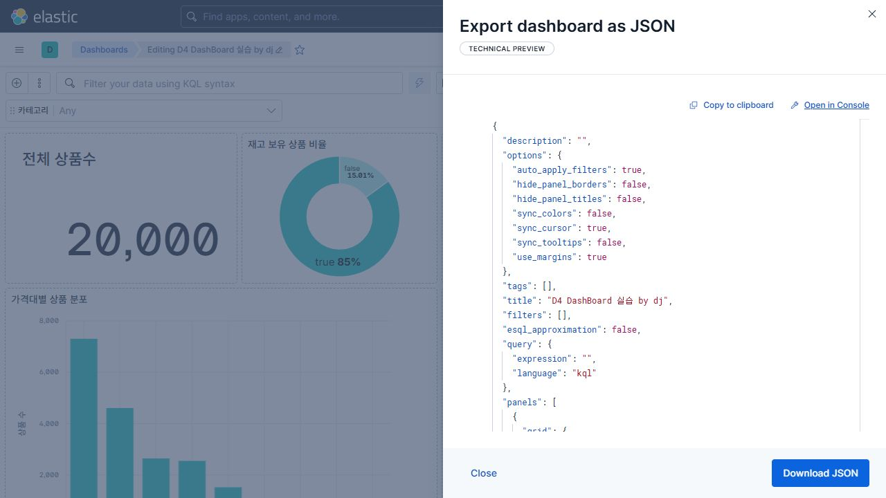

### 15.3 관련 객체를 포함한 이동용 백업

다른 Kibana로 Dashboard를 옮길 목적이면 다음을 사용합니다.

1. `Stack Management → Kibana → Saved Objects`를 엽니다.
2. 저장한 Dashboard를 선택합니다.
3. `Export`를 선택합니다.
4. 가능하면 관련 object 포함 옵션을 사용합니다.
5. 생성된 NDJSON 파일을 보관합니다.

### 15.4 PDF 메뉴가 없을 때

현재 수업용 Kibana 9.5.0 환경에는 Dashboard PDF 내보내기 메뉴가 보이지 않습니다. 정상이며 PDF를 제출 조건으로 사용하지 않습니다. 화면 캡처를 기본 증거로 제출하고 JSON/NDJSON은 선택 백업으로 사용합니다.

## 16. 선택 확장 패널

필수 6개 패널을 끝낸 학생만 하나를 선택합니다. 차트가 많다고 좋은 Dashboard는 아닙니다.

### 16.1 Gauge — 목표 범위 안의 현재값

1. 차트 유형 `Gauge`를 선택합니다.
2. `Metric`에 `Average of rating`을 둡니다.
3. `Minimum value`를 0, `Maximum value`를 5로 설정합니다.
4. 필요하면 `Goal value`를 4.0으로 설정합니다.
5. 실제 평균이 0~5 범위에 표시되는지 확인합니다.

### 16.2 Heat map — 두 조건 조합의 밀도

1. 차트 유형 `Heat map`을 선택합니다.
2. `Horizontal axis`에 `category` Top values 8을 둡니다.
3. `Vertical axis`에 `review_count` Intervals 또는 custom ranges를 둡니다.
4. `Cell value`는 Count of records로 둡니다.
5. 색이 진한 cell이 문서가 많은 조합인지 확인합니다.

Heat map은 지도가 아니라 두 축 조합의 밀도를 색으로 나타내는 표입니다.

### 16.3 Treemap — 계층형 구성비

1. 차트 유형 `Treemap`을 선택합니다.
2. `Group by`에 `category` Top values 8을 둡니다.
3. 더 세분화하려면 두 번째 Group에 `brand` Top values 5를 둡니다.
4. `Metric`은 Count of records로 둡니다.

### 16.4 Tag cloud — 자주 등장하는 tag 탐색

1. 차트 유형 `Tag cloud`를 선택합니다.
2. `Tags`에 `tags` Top values 20을 둡니다.
3. `Metric`은 Count of records로 둡니다.
4. 단어 크기로 정확한 차이를 비교하기 어렵다는 한계를 함께 기록합니다.

## 17. Kibana 9.5.0 차트 선택기에서 보이는 유형

수업 화면에서 확인되는 유형은 다음과 같습니다.

- Bar, Line, Area
- Metric, Table, Pie, Gauge
- Heat map, Waffle, Region map
- Treemap, Tag cloud, Mosaic
- Legacy Metric: 이전 방식이므로 새 수업에서는 사용하지 않음

Day 4 필수 범위는 Metric, Bar, Table, Pie를 Donut으로 설정, Line입니다. Gauge, Heat map, Treemap, Tag cloud는 선택입니다. Area, Waffle, Region map, Mosaic는 이번 수업에서 만드는 법을 외울 필요가 없습니다.

## 18. 최종 자가 점검

- [ ] Data View가 정확히 `products`를 바라본다.
- [ ] Discover에서 절대 시간 범위와 20,000건을 확인했다.
- [ ] KQL `in_stock : false`가 3,001건이고 삭제 후 20,000으로 복구됐다.
- [ ] Metric 1개, Bar 2개, Table 1개, Donut 1개, Line 1개가 있다.
- [ ] Donut은 Pie의 `Style → Donut hole`로 만들었다.
- [ ] Line의 `Minimum interval`을 `1M`로 설정했다.
- [ ] 모든 패널 제목이 보인다.
- [ ] category Options list가 있으며 `Any`로 복구된다.
- [ ] KQL, filter pill, Control을 모두 해제하면 20,000이다.
- [ ] Dashboard를 저장하고 목록에서 다시 열었다.
- [ ] 전체 화면 캡처를 저장했다.

## 공식 문서

- [Data Views](https://www.elastic.co/guide/en/kibana/current/data-views.html)
- [Discover 시작하기](https://www.elastic.co/docs/explore-analyze/discover/discover-get-started)
- [Lens](https://www.elastic.co/guide/en/kibana/current/lens.html)
- [Pie와 Donut 설정](https://www.elastic.co/docs/explore-analyze/visualize/charts/pie-charts)
- [Dashboard 공유와 내보내기](https://www.elastic.co/docs/explore-analyze/dashboards/sharing)
- [Saved Objects 내보내기](https://www.elastic.co/docs/extend/kibana/key-concepts/saved-objects/export)
