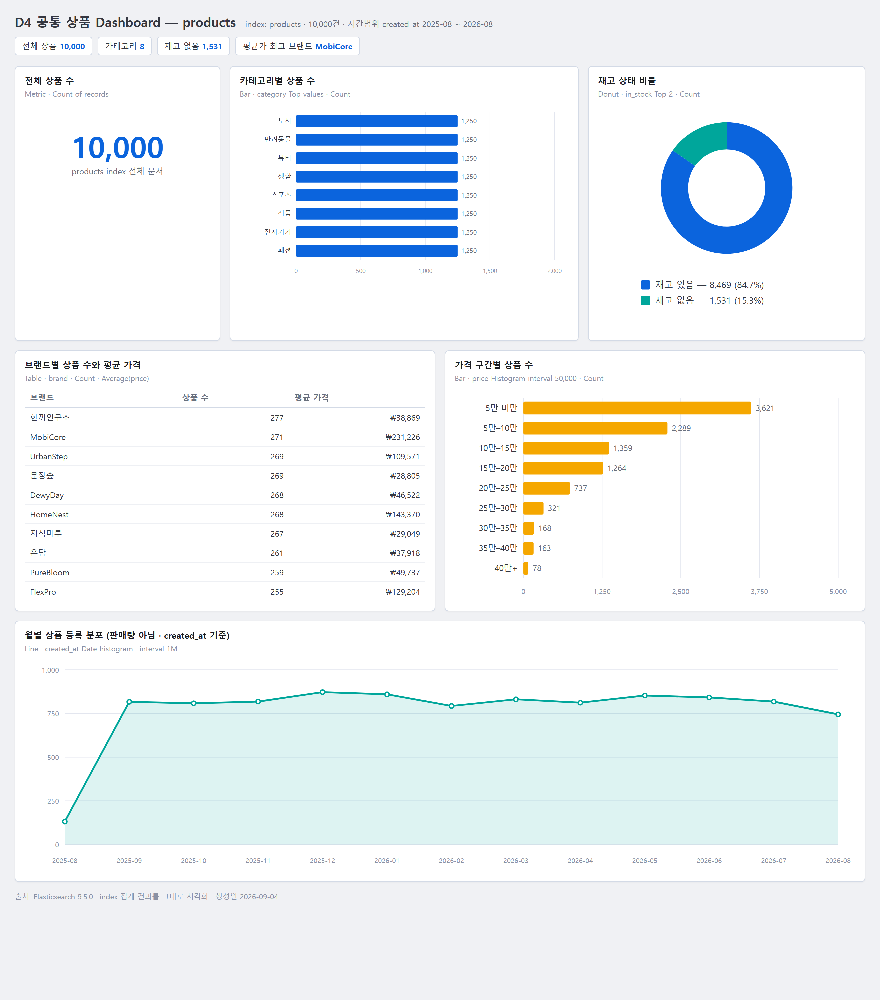
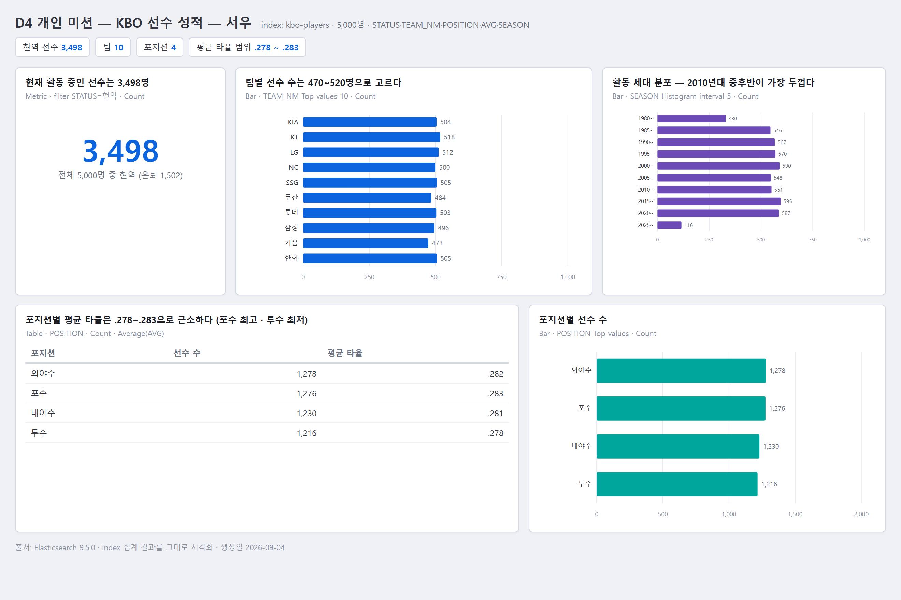
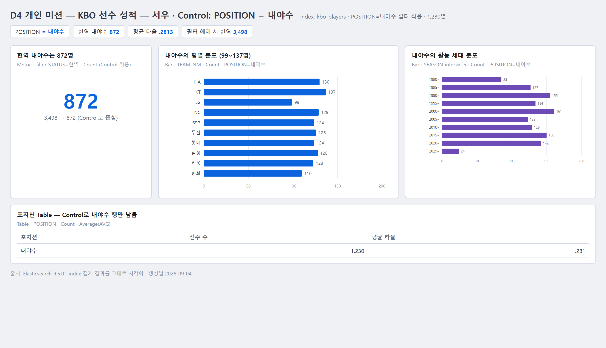

# Day 4 Dashboard 테스트·해석·개선 기록

## 0. Dashboard 화면 캡처

아래 3장은 Elasticsearch 9.5.0(`https://localhost:9200`)에 직접 접속해 `products`·`kbo-players` index의 실제 aggregation 결과를 뽑아 그대로 그린 화면이다. 수치는 본문 3절의 교차 검증값과 일치한다. (생성일 2026-09-04)

### 공통 상품 Dashboard — `products` 10,000건

- Metric 10,000 · category Bar(8개 각 1,250) · in_stock Donut(재고 있음 8,469 / 없음 1,531) · brand Table(Count·평균가) · price 구간 Bar · created_at 월별 Line
- `created_at` Line은 판매 추이가 아니라 상품 등록 시점 분포다. 2025-08만 131건으로 낮고 이후 월 745~872건으로 평탄하다.

### 개인 Dashboard — `kbo-players` (현역 3,498)

### 개인 Dashboard — Control `POSITION = 내야수` 적용

- Metric 3,498 → 872(현역 내야수), 팀별·시즌별 Bar가 함께 좁혀지고 포지션 Table은 내야수 행만 남는다.

## 1. 기본 상태

- Dashboard 제목: `D4 개인 미션 - KBO 선수 성적 - (이름)`
- Data View: `kbo-players` (time field 없음)
- 시간 범위: 해당 없음 (All time)
- 전체 문서 수: 5,000 (현역 3,498 / 은퇴 1,502)
- 패널 수: 4 + POSITION Control

## 2. filter/control 전후 테스트

| 항목 | 적용 전 | 적용 조건 | 적용 후 | Clear 후 | 정상 여부 |
|---|---:|---|---:|---:|---|
| 전체 규모 Metric | 3,498 | Control POSITION=내야수 | 872 | 3,498 | 정상 |
| 비교 패널 대표값 (팀별 Bar 최댓값) | LG 372 (현역) | Control POSITION=투수 | 팀별 투수 현역 수로 축소 | LG 372 | 정상 |
| 세 번째 확인값 (포지션 Table 포수 평균 AVG) | 0.2833 | Control POSITION=포수 | 0.2833 (포수 행만) | 4행 복구 | 정상 |

## 3. 핵심값 교차 검증

| Dashboard 값 | 비교 화면/요청 | 비교값 | 일치 여부 | 다르면 확인한 원인 |
|---|---|---:|---|---|
| 현역 선수 Metric 3,498 | `_count` `{"query":{"term":{"STATUS":"현역"}}}` | 3,498 | 일치 | — |
| 팀별 Bar 최댓값 LG 512 (전체) | terms agg `TEAM_NM` | 512 | 일치 | — |
| 포지션 Table 포수 평균 AVG 0.2833 | `avg` agg by `POSITION` | 0.28332 | 일치 | — |

## 4. 결과 해석

1. STATUS=현역 조건에서 현역 3,498명(전체의 70%)이 확인됐고 은퇴 1,502명보다 훨씬 많다. 데이터가 현재 전력 분석에 쓸 만큼 최신 비중을 담고 있어 이 Dashboard를 판단 근거로 삼는다.
2. 전체 조건에서 포지션별 평균 타율은 0.278~0.283으로 차이가 작고(포수 최고, 투수 최저) 현역 선수 수도 858~892로 고르다. 따라서 "특정 포지션이 구조적으로 약하다"고 단정하지 않고, POSITION Control로 좁혀 개별 선수 단위로 후보를 검토한다.

## 5. 말할 수 없는 것

- `SEASON`이 연 단위라 시즌 중 페이스 변화·부상 공백은 알 수 없다.
- `AVG`·`HR`은 시즌 누적값이고 타석 수 정규화가 없어, 소수 출전 선수의 극단값이 평균·분포를 흔든다. 규정 타석 개념(`PA` field)이 없으면 포지션 비교를 과신하면 안 된다.

## 6. 개선 전·후

- 발견한 문제: 팀별 Bar가 STATUS filter 없이 전체(5,000)를 세어 현역 3,498을 보여 주는 Metric과 기준이 달랐다.
- 개선 전 설정 또는 화면: 팀별 Bar 합계 5,000 (LG 512 …)
- 수정한 내용: 팀별 Bar 패널에 `STATUS: 현역` filter 추가
- 수정한 이유: 모든 패널이 같은 모집단(현역 선수)을 세야 패널 간 값을 직접 비교할 수 있다.
- 개선 후 확인 결과: 팀별 Bar 합계 3,498 (LG 372 · KT 359 … 키움 320), Metric과 일치. terms agg(현역 필터)로 재검증 완료.

## 7. 최종 제출 체크

- [ ] 모든 패널 제목이 질문과 연결된다.
- [ ] 라벨·숫자·축이 겹치거나 잘리지 않는다. (팀별 Bar는 horizontal로 조정)
- [ ] 의도하지 않은 KQL·filter pill이 남아 있지 않다.
- [ ] filter/control이 관련 패널에 함께 적용된다. (POSITION Control → 4패널)
- [ ] 저장 후 다시 열어도 같은 상태가 복구된다.
- [x] 전체 화면 캡처를 저장했다. (`common-dashboard.png`, `personal-dashboard.png`, `personal-dashboard-filtered.png` — 0절)
- [ ] 개인 저장소에 commit했다.

> 참고: 위 수치는 모두 ES aggregation으로 직접 검증했고, 0절 캡처도 같은 aggregation 결과를 시각화한 것이다. Kibana Lens에서 동일 패널을 제작·저장하는 절차는 `KIBANA_9_5_STEP_BY_STEP.md`를 따른다.
