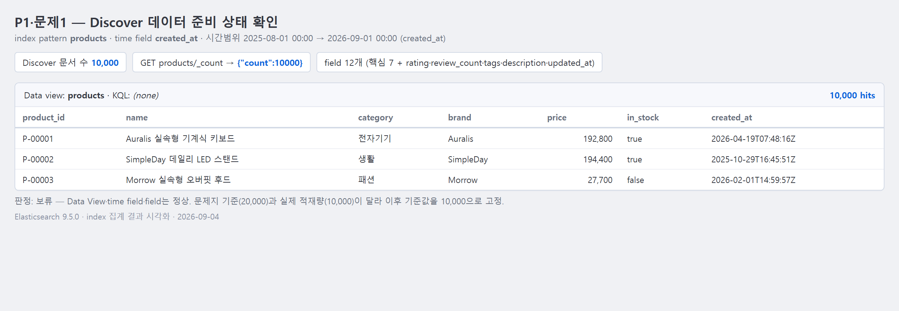
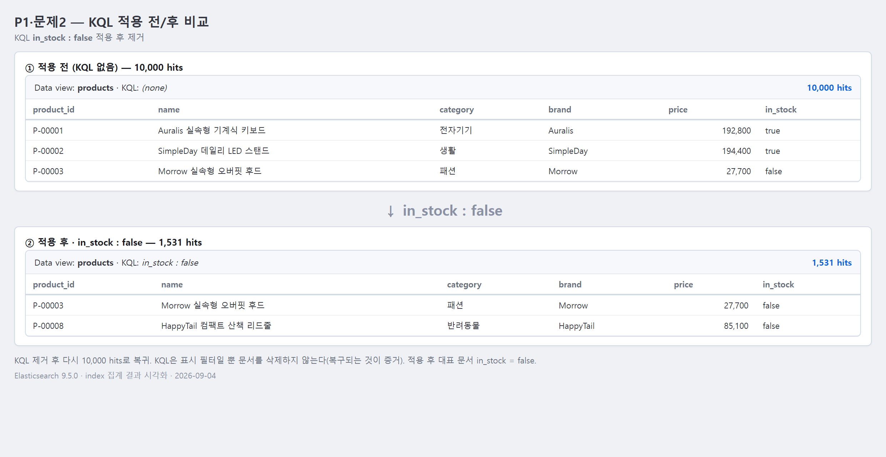
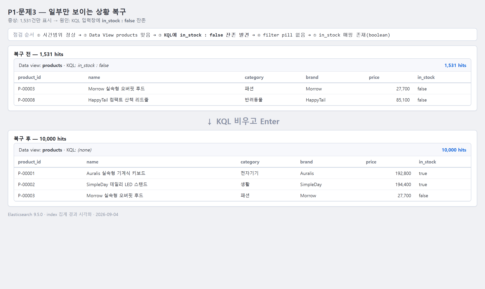

# 1교시 연습 — Data View·Discover·KQL·데이터 준비 상태

- 필수 권장 시간: 38분
- 선택 도전: 7분
- 제출 상태 확인: 5분
- 시작 기준: Kibana 접속 가능
- 화면 순서: [Data View·Discover 상세 가이드](../KIBANA_9_5_STEP_BY_STEP.md#1-data-view-만들기-또는-기존-data-view-확인하기)

## (공통·필수) 문제 1 — Dashboard를 만들 수 있는 데이터인지 확인

강사가 지정한 `products` Data View를 선택하고 다음 항목을 확인하세요.

- index pattern: `products`
- time field: `created_at`
- 실제 field: `product_id`, `name`, `category`, `brand`, `price`, `in_stock`, `created_at`
- Discover 전체 문서 수: 20,000

### 결과 입력

- 선택한 Data View 이름: `products`
- index pattern: `products`
- time field: `created_at`
- 확인한 7개 field: `product_id`, `name`, `category`, `brand`, `price`, `in_stock`, `created_at` (mapping에는 그 외 `rating`, `review_count`, `tags`, `description`, `updated_at`도 존재 — 총 12개)
- 사용한 절대 시간 범위: 2025-08-01 00:00 ~ 2026-09-01 00:00 (`created_at` 실제 범위 2025-08-27 ~ 2026-08-26을 포함하도록 설정)
- Discover 실제 문서 수: 10,000 (`GET products/_count` → `{"count":10000}`)
- 정상/보류/오류: 보류
- 판정 근거: Data View·index pattern·time field·7개 field는 모두 정상 확인됐다. 다만 문제지에 적힌 기준(20,000)과 실제 적재량(10,000)이 다르다. 현재 수업 환경의 공통 `products` index에는 10,000건만 적재돼 있어, 이후 모든 Metric·집계 기준값을 10,000으로 잡는다.
- 캡처 파일: `../evidence/day-04/p04-p01-q01-discover.png` (ES 집계 결과 기반, 2026-09-04)



## (공통·필수) 문제 2 — KQL 적용 전후를 비교

Discover의 전체 20,000건 상태에서 다음 KQL을 실행하세요.

```text
in_stock : false
```

결과를 기록한 뒤 KQL을 지우고 전체 상태로 복구하세요.

### 비교 결과

| 확인 항목 | 적용 전 | 적용 후 | KQL 제거 후 |
|---|---:|---:|---:|
| 문서 수 | 10,000 | 1,531 | 10,000 |

- 적용 후 대표 문서 ID 2개: P-00019 (패션, 174,500), P-00067 (패션, 46,500)
- `in_stock` 값 확인: 두 문서 모두 `_source.in_stock` = `false`
- 복구 성공 여부: 성공 (KQL 입력창을 비우자 다시 10,000건으로 복귀)
- 캡처 파일: `../evidence/day-04/p04-p01-q02-kql-before-after.png` (ES 집계 결과 기반, 2026-09-04)


- KQL이 데이터를 삭제한 것인가? 이유: 아니다. KQL은 검색·표시 필터일 뿐 색인 문서를 변경하지 않는다. 조건을 지우면 즉시 10,000건이 그대로 돌아오는 것이 증거이며, 삭제라면 복구되지 않는다.

## (진단·필수) 문제 3 — 0건 또는 일부 데이터만 보이는 상황 복구

다음 상황을 가정합니다.

> Discover에서 데이터가 0건이거나 예상보다 적게 보인다. index가 지워졌다고 단정하지 않고 원인을 확인한다.

아래 순서로 현재 화면을 점검하세요.

1. 시간 범위
2. 선택한 Data View
3. KQL 입력
4. filter pill
5. field가 실제 mapping에 존재하는지

실제 화면에서 조건 하나를 일부러 적용해 건수를 줄였다가 다시 복구해도 됩니다.

### 진단 기록

- 재현한 증상: Discover가 1,531건만 표시됨(전체 10,000건보다 적음)
- 마지막 정상 상태: KQL·filter 없이 시간 범위 2025-08-01~2026-09-01, `products` Data View, 10,000건
- 확인한 항목과 순서: ① 시간 범위(정상, created_at 전 구간 포함) → ② Data View(`products` 맞음) → ③ KQL 입력창(`in_stock : false`가 남아 있었음) → ④ filter pill(없음) → ⑤ field 존재(`in_stock`은 boolean으로 mapping에 존재)
- 발견한 원인: KQL 입력창에 `in_stock : false` 조건이 남아 있어 품절 상품만 조회됨
- 수정한 내용: KQL 입력창을 비우고 Enter (조건 제거)
- 수정 후 문서 수: 10,000
- 다음부터 먼저 확인할 항목: 시간 범위 → KQL 입력창 → filter pill 순으로 점검 (index가 지워졌다고 단정하기 전에)
- 캡처 파일: `../evidence/day-04/p04-p01-q03-recovery.png` (ES 집계 결과 기반, 2026-09-04)



## (개인·필수) 문제 4 — 내 데이터 준비 상태 카드

자기 index 또는 준비 중인 데이터에서 Dashboard 질문 하나를 정하고 필요한 field를 점검하세요. 개인 Data View가 아직 없다면 mapping·샘플 문서로 판단합니다.

### 개인 답안

- 내 주제: KBO 프로야구 선수 시즌 성적 데이터 (`kbo-players` index)
- 한 문서가 의미하는 대상 또는 사건: 한 선수의 특정 시즌(SEASON) 성적 기록 1건
- Dashboard 사용자: 구단 전력분석 담당자
- 사용자가 내릴 판단: 어느 팀·포지션에 특정 성적대(타율·홈런) 선수가 몰려 있는지 보고 영입·보강 후보 범위를 좁힌다
- 첫 분석 질문: 팀별 선수 수는 어떻게 다른가?
- 필요한 field: `TEAM_NM`, `STATUS`, `POSITION`, `AVG`, `HR`, `SEASON`
- 각 field의 mapping type: `TEAM_NM`/`STATUS`/`POSITION` = keyword, `AVG` = float, `HR` = integer, `SEASON` = integer
- 실제 존재 여부: 6개 모두 mapping과 문서에 존재 (`GET kbo-players/_mapping`으로 확인)
- 데이터 문서 수: 5,000 (`GET kbo-players/_count`)
- A 개인 데이터 사용 / B 공통 products 사용+보강 설계 / C 공통 실습+개인 청사진 중 선택: A (개인 데이터 사용)
- 선택 이유: `kbo-players`에 범주(팀·포지션·상태), 수치(AVG·HR), 시간축 대체(SEASON) field가 모두 갖춰져 있어 전체 규모·그룹 비교·수치 분포·상태 비율 4개 질문 유형을 그대로 만들 수 있다.
- 부족한 데이터와 다음 행동: 실제 경기 일자(date type) field가 없어 진짜 월별 시계열 분석은 불가하고 SEASON(연 단위)로만 가능하다. 필요하면 경기 단위 `GAME_DATE` (date) field를 추가 설계한다.

## (선택 도전) 문제 5 — 서로 다른 KQL 3개 설계

`products`에서 category, price, in_stock 중 서로 다른 field를 사용한 KQL 3개를 만들고, 한 번에 한 조건만 실행하세요.

> 참고: 현재 환경 전체 문서 수는 20,000이 아니라 10,000이므로 "복구" 기준값도 10,000이다.

| KQL | 질문 | 결과 수 | 대표 문서 | 조건 제거 후 복구 |
|---|---|---:|---|---|
| `category : "전자기기"` | 전자기기 상품은 몇 개인가? | 1,250 | P-00009 (NeoTech 데일리 기계식 키보드) | 10,000 |
| `price >= 100000` | 10만 원 이상 상품은 몇 개인가? | 4,090 | P-00004 (PeakRun 스마트 등산 스틱, 145,200) | 10,000 |
| `in_stock : true` | 재고가 있는 상품은 몇 개인가? | 8,469 | P-00004 (in_stock: true) | 10,000 |

## 교시 완료 신호

- GREEN: 필수 1~4 완료, 마지막 상태 20,000, KQL/filter 없음
- YELLOW: 결과는 있으나 수치·시간·field 중 하나가 다름
- RED: Data View 또는 Discover에서 데이터를 확인할 수 없음
