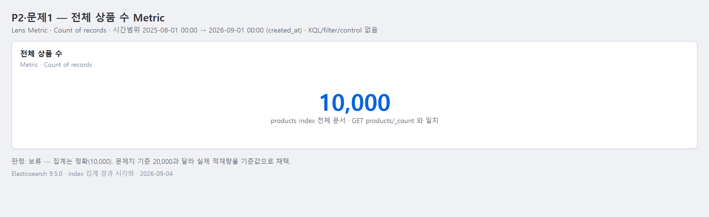
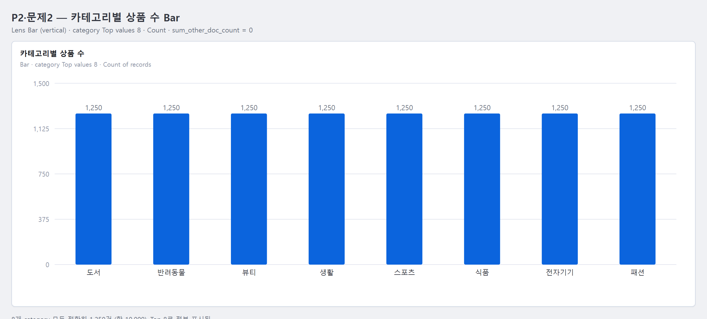
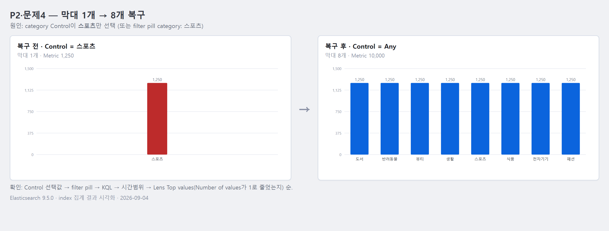

# 2교시 연습 — Metric·Bar·Top values

- 필수 권장 시간: 40분
- 선택 도전: 5분
- 제출 상태 확인: 5분
- 시작 기준: Discover 20,000건, KQL/filter 없음
- 화면 순서: [Metric](../KIBANA_9_5_STEP_BY_STEP.md#5-패널-1--전체-상품-수-metric), [category Bar](../KIBANA_9_5_STEP_BY_STEP.md#6-패널-2--카테고리별-상품-수-bar)

## (공통·필수) 문제 1 — 전체 상품 수 Metric 제작

빈 Dashboard에 Lens Metric을 추가하세요.

- Data View: 공통 `products`
- 계산: Records 또는 Count of records
- 제목: `전체 상품 수`
- 정상 기준: 20,000

### 결과 입력

- Dashboard 이름: 
- 사용한 계산: Count of records (Records)
- 실제 Metric 값: 10,000
- 시간 범위: 2025-08-01 00:00 ~ 2026-09-01 00:00
- KQL/filter/control 상태: 없음 (모두 비어 있음)
- 정상/보류/오류와 이유: 보류. Count는 10,000으로 정확히 집계되나 문제지 정상 기준(20,000)과 다르다. 현재 환경 `products` 적재량이 10,000이므로 이 값이 정상이며 이후 패널 기준값을 10,000으로 잡는다.
- 캡처 파일: `../evidence/day-04/p04-p02-q01-metric.png` (ES 집계 결과 기반, 2026-09-04)

## (공통·필수) 문제 2 — category Bar 제작

같은 Dashboard에 category별 상품 수 Bar를 만드세요.

- 그룹 field: `category`
- 그룹 방식: Top values
- Number of values: 8
- 값: Count of records
- 제목: `카테고리별 상품 수`

### 설정·결과 입력

- Bar 방향: vertical (기본)
- x축 또는 category 차원: `category` (Top values)
- y축 또는 Metric: Count of records
- Number of values: 8
- 표시된 category 수: 8
- 각 category 값이 공통 기준과 일치하는가: 예. 8개 category가 모두 정확히 1,250건으로 균등하다 — 도서·반려동물·뷰티·생활·스포츠·식품·전자기기·패션 (합 10,000). `sum_other_doc_count` = 0이라 8개로 전부 표시됨.
- 캡처 파일: `../evidence/day-04/p04-p02-q02-category-bar.png` (ES 집계 결과 기반, 2026-09-04)

## (변형·필수) 문제 3 — Bar 방향 한 가지만 바꿔 비교

동일한 category·Count·Top 8을 유지하고 Bar 방향만 vertical과 horizontal로 바꿔 보세요.

방향은 `Style → Appearance → Bar orientation`에서 바꿉니다. 축 label 방향과 혼동하지 않습니다.

| 비교 | vertical | horizontal |
|---|---|---|
| category 이름 가독성 | 이름이 2~4자로 짧아 x축에서 그대로 읽힘 (길면 회전·생략됨) | 이름이 왼쪽에 수평으로 나열돼 길이와 무관하게 안정적 |
| 값 비교 속도 | 막대 높이로 비교, 값이 비슷하면 차이 판단 느림 | 막대 길이 + 위→아래 정렬로 순위 파악 빠름 |
| 잘림·겹침 | category 수가 많거나 이름이 길면 label 겹침 발생 | 겹침 거의 없음 |

- 최종 선택: vertical
- 선택 이유: 이 데이터는 category가 8개뿐이고 이름이 모두 짧으며 값도 1,250으로 동일해 어느 방향이든 읽힌다. 표준형인 vertical을 유지한다. (category가 많거나 이름이 길면 horizontal로 전환)
- 다른 설정을 동시에 바꾸지 않았는가: 예. field(`category`)·계산(Count)·Top 8을 고정하고 `Bar orientation`만 vertical↔horizontal로 변경했다.

## (진단·필수) 문제 4 — 막대가 하나만 남은 상황 복구

Bar에 `스포츠` 등 하나의 category만 보인다고 가정합니다. Dashboard에서 다음을 확인하고 원래 8개 category로 복구하세요.

1. category Control 선택값
2. 상단 filter pill
3. KQL
4. 시간 범위
5. Lens의 Top values 설정

### 진단 기록

- 보이던 category: 스포츠 (막대 1개, Count 1,250)
- 발견한 제한 조건: category Control에서 `스포츠`만 선택된 상태 (또는 상단 filter pill `category: 스포츠`)
- 제거 또는 초기화한 항목: Control 선택값을 `Any`로 되돌림 / filter pill 삭제
- 복구 후 막대 수: 8
- 복구 후 Metric 값: 10,000
- 원인이 없었다면 추가로 확인한 Lens 설정: Top values의 `Number of values`가 1로 줄었는지, `category` field에 개별 filter가 걸렸는지 확인
- 캡처 파일: `../evidence/day-04/p04-p02-q04-bar-recovery.png` (ES 집계 결과 기반, 2026-09-04)

## (개인·선택 도전) 문제 5 — 내 범주 field로 Metric+Bar 설계

자기 데이터의 전체 규모 Metric과 범주별 Bar를 설계하거나 만드세요. 범주 field가 없으면 필요한 field를 설계합니다.

- 개인 index/Data View: `kbo-players`
- 전체 규모가 의미하는 것: 적재된 선수-시즌 성적 기록 총 건수 (5,000)
- 범주 field: `TEAM_NM` (keyword)
- 실제 고유값 수: 10 (KT, LG, SSG, 한화, KIA, 롯데, NC, 삼성, 두산, 키움)
- Top N 선택값과 이유: Top 10 — 팀이 10개뿐이라 전체를 한 번에 표시
- 예상 사용자 판단: 팀별 데이터 양이 고른지 확인하고, 특정 팀 데이터가 부족하면 수집을 보완
- 실제 제작 여부: 집계로 값 확인 (팀별 473~518건으로 거의 균등, 최다 KT 518 / 최소 키움 473)
- 부족한 경우 필요한 field와 예시값: 없음 — `TEAM_NM`으로 충분
- 캡처 또는 설계 문서 경로: `evidence/day-04/dashboard-plan.md`

## 교시 완료 신호

- GREEN: Metric 20,000, category Bar 8개, 제목 2개, 비교·복구 기록 완료
- YELLOW: 패널은 있으나 값·Top N·제목 중 하나가 다름
- RED: Lens 저장 또는 Dashboard 복귀 불가
