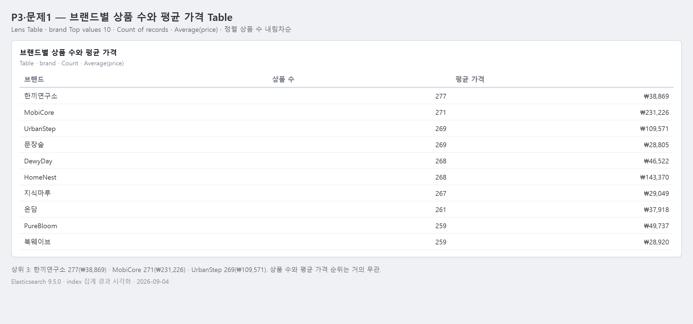
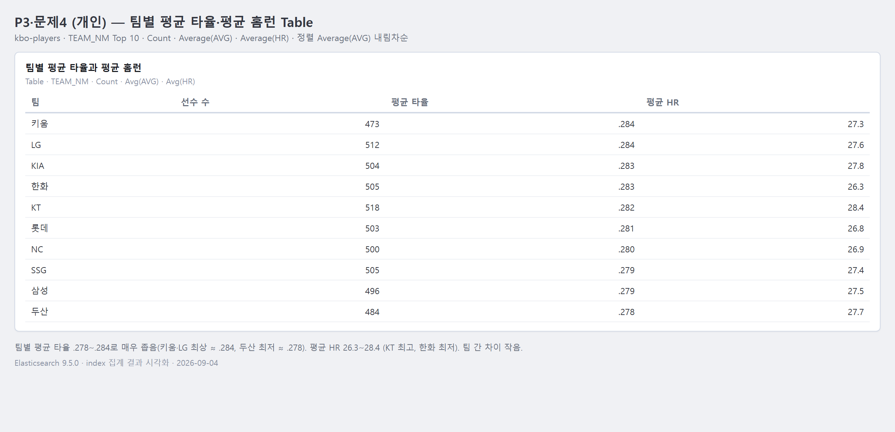

# 3교시 연습 — Table·Count·Average·정렬

- 필수 권장 시간: 40분
- 선택 도전: 5분
- 제출 상태 확인: 5분
- 시작 기준: 공통 Dashboard의 Metric과 category Bar 저장 완료
- 화면 순서: [Table 상세 가이드](../KIBANA_9_5_STEP_BY_STEP.md#7-패널-3--브랜드별-상품-수와-평균-가격-table)

## (공통·필수) 문제 1 — brand Table 제작

다음 세 열을 가진 Table을 만드세요.

1. `brand` Top values
2. Count of records
3. Average of `price`

Average는 `Metrics → Quick function → Average → Field: price`로 추가합니다. 열 Name은 `브랜드`, `상품 수`, `평균 가격`으로 지정합니다.

패널 제목은 `브랜드별 상품 수와 평균 가격`으로 저장합니다.

### 설정·결과 입력

- brand Number of values: 10
- 첫 번째 Metric과 label: Count of records → `상품 수`
- 두 번째 Metric과 label: Average of `price` → `평균 가격`
- 표시된 행 수: 10
- 첫 3개 브랜드와 상품 수: (Top values = Count 내림차순) 한끼연구소 277, 냥이마켓 272, MobiCore 271
- 첫 3개 브랜드의 평균 가격: 한끼연구소 ≈ 38,869원, 냥이마켓 ≈ 116,968원, MobiCore ≈ 231,226원
- 캡처 파일: `../evidence/day-04/p04-p03-q01-brand-table.png` (ES 집계 결과 기반, 2026-09-04)

## (변형·필수) 문제 2 — 정렬 기준 하나만 바꿔 비교

Table의 나머지 설정을 유지하고 다음 두 정렬을 비교하세요.

- 설정 A: 상품 수 내림차순
- 설정 B: 평균 가격 내림차순

| 비교 | 설정 A (상품 수 내림차순) | 설정 B (평균 가격 내림차순) |
|---|---|---|
| 첫 번째 브랜드 | 한끼연구소 | NeoTech |
| 첫 번째 상품 수 | 277 | 243 |
| 첫 번째 평균 가격 | ≈ 38,869원 | ≈ 232,804원 |

- 순서가 달라진 이유: 정렬 키가 다르다. A는 행 개수(Count of records), B는 가격 평균(Average of price). 상품 수가 많은 브랜드가 곧 비싼 브랜드는 아니므로 두 순위는 거의 무관하다.
- “상품이 많은 브랜드”에 맞는 정렬: 설정 A (상품 수 내림차순)
- “평균 가격이 높은 브랜드”에 맞는 정렬: 설정 B (평균 가격 내림차순)
- 최종 Dashboard에서 선택한 정렬과 이유: 상품 수 내림차순(A). 이 패널의 주 질문이 "어떤 브랜드가 상품 구성을 많이 차지하는가"라서 규모가 큰 브랜드를 위에 둔다.

## (진단·필수) 문제 3 — 평균만 보고 결론 내리는 오류 찾기

평균 가격이 높은 브랜드 하나를 선택하세요. 그 브랜드의 상품 수를 함께 확인하고 다음 질문에 답하세요.

- 선택한 브랜드: NeoTech
- 평균 가격: ≈ 232,804원
- 상품 수: 243
- 평균 가격만 보면 내릴 수 있는 결론: "NeoTech는 고가 브랜드다"
- 상품 수를 함께 보면 추가로 필요한 주의: 243건은 전체 10,000건의 약 2.4%로 표본이 한정적이고, 대부분 전자기기 카테고리에 몰려 있다. 브랜드가 본질적으로 비싸다기보다 취급 품목(전자기기)이 비싼 것일 수 있다.
- 현재 데이터로 말할 수 없는 것: 실제 판매량·매출·마진. `price`는 등록가일 뿐이며 얼마나 팔렸는지는 알 수 없다.
- Count와 Average를 함께 보여 줘야 하는 이유: 평균은 몇 건으로 계산됐는지에 따라 신뢰도가 크게 달라진다. Count 없이 평균만 보면 소수의 고가 상품이 끌어올린 평균을 브랜드 전체 특성으로 오해하게 된다.

## (개인·필수) 문제 4 — 내 데이터의 정확한 값 비교 Table

자기 데이터에서 범주 field 하나와 숫자 field 하나를 선택해 Table을 설계하거나 만드세요.

- 사용자: 구단 전력분석 담당자
- 분석 질문: 팀별 타자의 평균 타율과 평균 홈런은 어떻게 다른가?
- 행에 사용할 범주 field: `TEAM_NM` (keyword)
- Metric 1과 이유: Count of records — 팀별 표본 수를 함께 봐야 평균의 신뢰도를 판단할 수 있음
- Metric 2와 이유: Average of `AVG` — 팀 타선의 평균 타율 (선수 평가 1순위 지표)
- Top N: 10 (팀이 10개뿐이라 전체)
- 정렬 기준: Average of `AVG` 내림차순
- 완료 기준: 10개 팀 행이 모두 표시되고 각 행에 Count와 평균 2개 값이 채워짐
- 실제 결과 또는 데이터 부족 상태: 팀별 평균 타율 0.278~0.284로 매우 좁은 범위(최상위 LG·키움 ≈ 0.284, 삼성 ≈ 0.2785), 팀별 평균 HR 26.3~28.4 (KT 최고 28.4, 한화 최저 26.3). 팀 간 차이가 작아 "특정 팀 타선이 압도적"이라고 말하긴 어렵다.
- 캡처/설계 문서 경로: `evidence/day-04/dashboard-plan.md`

## (선택 도전) 문제 5 — Table에 필요한 Metric 하나 추가

`rating` 또는 `review_count`처럼 실제 mapping에 있는 숫자 field 중 하나를 선택해 세 번째 Metric을 추가하고, 판단에 도움이 되는지 평가하세요.

- 추가한 field와 계산: Average of `rating` (열 이름 `평균 평점`)
- 추가 전 질문: 브랜드별 상품 수와 평균 가격은 어떻게 다른가?
- 추가 후 알 수 있는 것: 가격대와 별개로 브랜드별 평균 만족도(평점) 비교 가능. 전체 평균 rating은 약 3.50 (범위 2.0~5.0)이라 이보다 높고 낮은 브랜드를 구분할 수 있다.
- 표가 너무 복잡해졌는가: 3개 metric까지는 읽을 만하다. 4개 이상이면 한 행이 길어져 판단이 느려진다.
- 유지/제거 결정과 이유: 유지. 가격만으로 브랜드 매력을 판단하면 오해할 수 있고, 평점이 "비싼데 평이 낮은 브랜드 / 싼데 평이 좋은 브랜드"를 드러내 보완 지표가 된다.

## 교시 완료 신호

- GREEN: 3열 Table, 정렬 비교, 평균 해석, 개인 Table 설계 완료
- YELLOW: Table은 있으나 Average·정렬·label 중 하나가 미완료
- RED: Table에 brand 행 또는 price 평균을 표시할 수 없음
