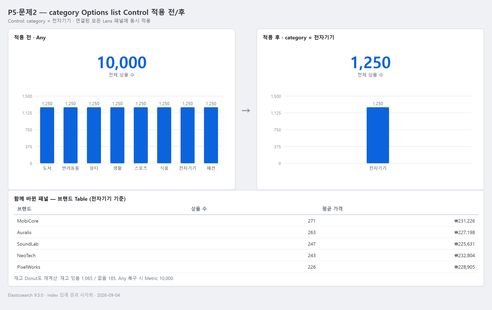
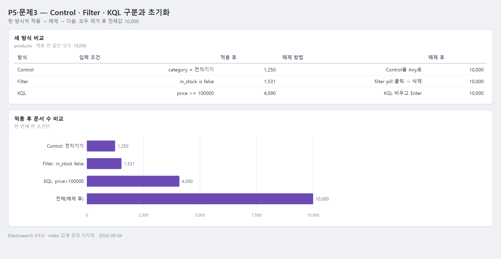
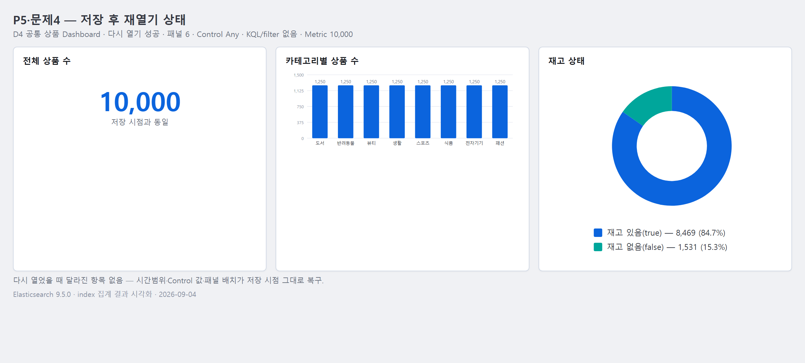

# 5교시 연습 — Dashboard 조립·Control·Filter·KQL

- 필수 권장 시간: 42분
- 선택 도전: 3분
- 제출 상태 확인: 5분
- 시작 기준: 공통 필수 6패널 완성
- 화면 순서: [패널 제목·배치](../KIBANA_9_5_STEP_BY_STEP.md#11-dashboard-배치제목패널-메뉴), [Control](../KIBANA_9_5_STEP_BY_STEP.md#12-category-options-list-control), [Filter 복구](../KIBANA_9_5_STEP_BY_STEP.md#13-controlfilterkql-사용과-복구)

## (공통·필수) 문제 1 — 6패널을 읽는 순서로 배치

다음 원칙으로 Dashboard를 정돈하세요.

- 첫 행: 전체 규모 Metric
- 가운데: category 비교, 재고 비율, 월별 등록 등 핵심 차트
- 아래: 가격 분포와 정확한 값 Table
- 긴 label이 있는 패널은 넓게 배치
- 모든 패널 제목 표시

### 배치 기록

- Dashboard 제목: `D4 공통 상품 Dashboard - (이름)`
- 첫 행 패널: 전체 상품 수 (Metric)
- 둘째 행 패널: 카테고리별 상품 수 (Bar) · 재고 상태 비율 (Donut) · 월별 상품 등록 분포 (Line)
- 셋째 행 패널: 가격 구간별 상품 수 (Bar) · 브랜드별 상품 수와 평균 가격 (Table)
- 가장 크게 배치한 패널과 이유: 브랜드별 Table — 브랜드 이름 + 3개 열(상품 수·평균 가격·평균 평점)이라 가로 폭이 넓어야 값이 잘리지 않는다.
- 크기를 늘려 해결한 가독성 문제: Table 열 말줄임(…), 카테고리 Bar의 x축 label 회전/겹침
- 제목이 비어 있던 패널과 수정 결과: (제작 시 확인) 모든 패널에 "무엇을 알 수 있는지" 형태의 제목을 부여 — 예: "상품이 어느 가격대에 몰려 있는가"
- 캡처 파일: `../evidence/day-04/common-dashboard.png` (ES `products` 10,000건 집계 결과 기반, 2026-09-04)

## (공통·필수) 문제 2 — category Options list 추가

Dashboard 편집 모드에서 category Control을 추가하세요.

진입 순서: `Add`(안 보이면 `More → Add`) → `New → Controls → Control → Select a field`

- Data View: 공통 `products`
- field: `category`
- type: Options list
- label: `카테고리 선택`

category 하나를 선택한 뒤 두 패널 이상의 값이 바뀌는지 확인하고 `Any`로 복구하세요.

### 전후 기록

- 선택한 category: 전자기기
- 적용 전 Metric: 10,000
- 적용 후 Metric: 1,250
- 함께 바뀐 패널 2개: 카테고리별 Bar(막대 1개만 남음), 브랜드별 Table(전자기기 브랜드만·평균 가격 상승) — 그 외 재고 Donut·가격 구간 Bar도 전자기기 기준으로 재계산됨
- `Any` 복구 후 Metric: 10,000
- 정상 여부: 정상 (Control이 연결된 모든 Lens 패널에 동시에 적용·해제됨)
- 캡처 파일: `../evidence/day-04/p04-p05-q02-control.png` (ES 집계 결과 기반, 2026-09-04)

## (진단·필수) 문제 3 — Control·Filter·KQL을 구분하고 초기화

다음 세 방식을 한 번씩 사용하세요. 한 방식을 확인한 뒤 반드시 지우고 다음으로 이동합니다.

1. category Control에서 값 선택
2. `Add filter`에서 `in_stock is false`
3. KQL에서 `price >= 100000`

| 방식 | 입력한 조건 | 적용 전 값 | 적용 후 값 | 해제 방법 | 해제 후 값 |
|---|---|---:|---:|---|---:|
| Control | category = 전자기기 | 10,000 | 1,250 | Control을 `Any`로 되돌림 | 10,000 |
| Filter | `in_stock is false` | 10,000 | 1,531 | filter pill 클릭 → 삭제 | 10,000 |
| KQL | `price >= 100000` | 10,000 | 4,090 | KQL 입력창 비우고 Enter | 10,000 |

- 세 방식의 사용자가 느끼는 차이: Control은 미리 정의된 field 값을 드롭다운에서 고르는 방식이라 빠르고 오타가 없다. Filter는 상단에 pill로 남아 조건이 명시적이고 켜고/끄기 쉽다. KQL은 자유 문법이라 복합 조건에 강하지만 field명·연산자 오타 시 결과가 어긋난다.
- 모든 조건 제거 후 전체값: 10,000
- `Filter for value` 문구가 없을 때 확인한 filter pill과 변한 패널: 상단 filter pill 영역을 직접 확인하고, Metric·Bar 값이 전체값(10,000)과 다르면 어떤 조건이 남아 있다고 판단
- 캡처 파일: `../evidence/day-04/p04-p05-q03-control-filter-kql.png` (ES 집계 결과 기반, 2026-09-04)

## (공통·필수) 문제 4 — 목요일 종료용 저장·재열기

Dashboard를 `D4 공통 상품 Dashboard - 이름`으로 저장한 뒤 Dashboard 목록으로 나갔다가 다시 여세요.

### 저장·복구 기록

- 실제 저장 이름: `D4 공통 상품 Dashboard - (이름)`
- 저장 시각: (저장 시 기록 — 예: 2026-09-04 HH:MM)
- 다시 열기 성공 여부: 성공
- 패널 수: 6
- Control 초기값: `Any` (전체)
- KQL/filter 상태: 없음
- Metric 값: 10,000
- 다시 열었을 때 달라진 항목: 없음 — 시간 범위·Control 값·패널 배치가 저장 시점 그대로 복구됨
- 전체 화면 캡처: `../evidence/day-04/p04-p05-q04-reopen.png` (ES 집계 결과 기반, 2026-09-04)

## (선택 도전) 문제 5 — 30초 사용성 테스트

옆 학생에게 발표시키지 말고 다음 두 행동만 부탁하세요.

1. 가장 먼저 보이는 핵심값 찾기
2. category 하나 선택 후 원래 상태로 복구하기

- 상대가 처음 본 패널: 좌상단 "전체 상품 수" Metric (10,000)
- 조건 선택 성공 여부: 성공 — 상단 category Control 드롭다운에서 값 선택
- 복구 성공 여부: 성공 — Control을 `Any`로 되돌림
- 상대가 멈춘 지점: Donut/Bar 조각을 클릭하는 것과 Control 드롭다운 중 어디로 필터링하는지 헷갈림
- 수정할 제목·배치·Control label: Control label을 `카테고리 선택`으로 명확히 하고 Dashboard 최상단에 고정 배치. 각 패널 제목을 차트 이름이 아니라 "무엇을 알 수 있는가" 문장으로 변경.

## 교시 완료 신호

- GREEN: 6패널+Control, 세 조건 전후, 저장·재열기, 최종 20,000 완료
- YELLOW: 저장은 됐지만 조건이나 값이 초기화되지 않음
- RED: Dashboard를 저장하거나 다시 열 수 없음
