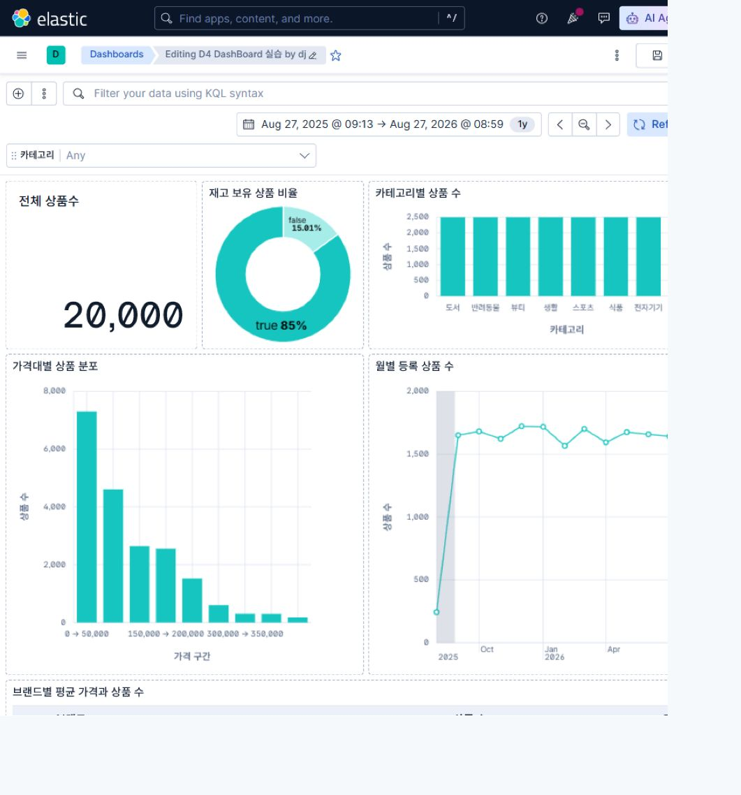
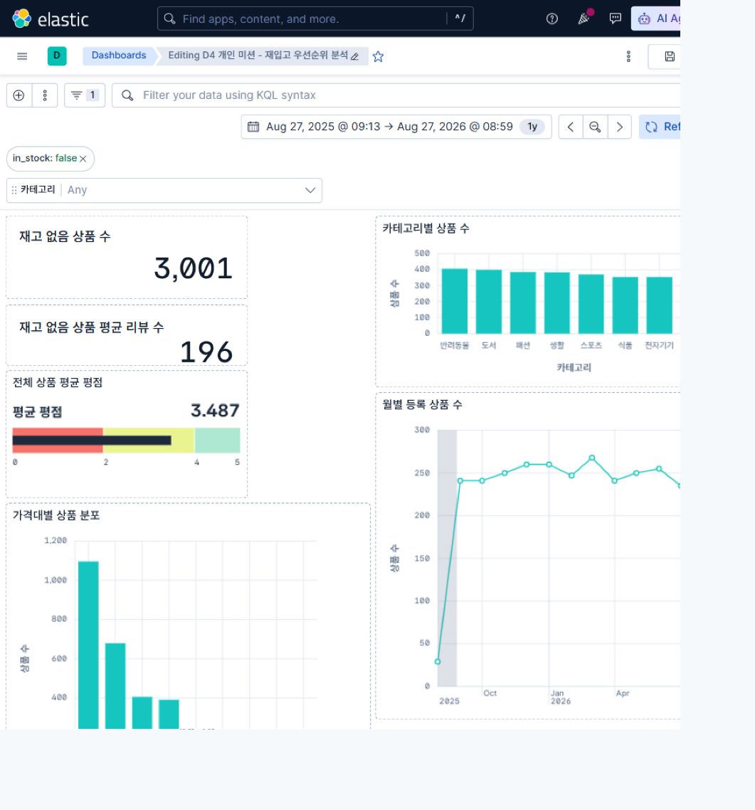
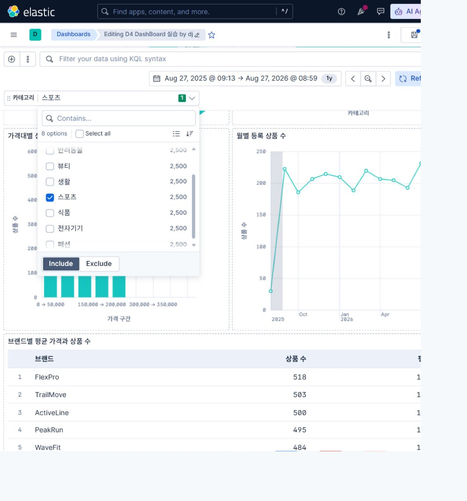

# ES 5일 PBL — Day 4 v2 학생교재

- 주제: Kibana Dashboard 직접 만들기
- 환경: Elasticsearch 9.5.0, Kibana 9.5.0, Windows 11
- 공통 index: `products` / 예상 문서 수: 20,000
- 실행 정본: [`PRACTICE_GUIDE.md`](PRACTICE_GUIDE.md)
- 화면별 상세 클릭 순서: [`KIBANA_9_5_STEP_BY_STEP.md`](KIBANA_9_5_STEP_BY_STEP.md)
- 모든 차트 완성형: [`CHART_GALLERY.md`](CHART_GALLERY.md)

> 이 교재는 수업 흐름과 판단 기준을 설명합니다. 메뉴 위치와 입력값이 기억나지 않으면 상세 클릭 순서 문서를 열어 해당 번호부터 그대로 따라 합니다.

## §1 오늘의 목표

오늘은 예쁜 차트를 많이 만드는 것이 목적이 아닙니다. 질문을 정하고, 그 질문에 필요한 field가 실제 데이터에 있는지 확인하고, 맞는 시각화를 만들어, 결과를 검증하는 것이 목적입니다.

### §1.1 최종 결과



공통 Dashboard에는 다음 6개 패널을 만듭니다.

| 질문 | field·계산 | 시각화 |
|---|---|---|
| 전체 상품은 몇 개인가? | Records count | Metric |
| 카테고리별 상품 수는 어떤가? | `category` Top values + Count | Bar |
| 브랜드별 상품 수와 평균 가격은? | `brand` Top values + Count + Average `price` | Table |
| 상품 가격은 어느 구간에 많은가? | `price` Intervals + Count | Bar |
| 재고 있음/없음 비율은? | `in_stock` Top values + Count | Donut |
| 상품 등록 시점은 월별로 어떤가? | `created_at` Date histogram + Count | Line |

### §1.2 질문에서 차트까지

`분석 질문 → 필요한 field → 계산 방식 → 차트 → 판단·행동` 순서로 생각합니다.

예: “어느 카테고리에 상품이 많은가?” → `category` → 그룹별 문서 수 → Bar → 카테고리 간 규모 비교

## §2 네 화면의 역할

### §2.1 Data View·Discover·Lens·Dashboard


| 화면 | 한 문장 역할 | 이럴 때 사용 |
|---|---|---|
| Data View | Kibana가 사용할 index와 field를 연결한다 | 처음 index를 선택하거나 field가 안 보일 때 |
| Discover | 실제 문서와 field·시간·검색 조건을 확인한다 | 차트를 만들기 전 데이터 상태를 점검할 때 |
| Lens | field와 계산을 선택해 시각화를 만든다 | Metric, Bar, Table, Donut, Line을 만들 때 |
| Dashboard | 여러 패널과 filter/control을 한 화면에 배치한다 | 여러 질문을 함께 보고 조건을 바꿀 때 |

Data View는 데이터를 복사하지 않습니다. 같은 `products`를 바라보는 Data View를 여러 개 만들 수 있지만, 수업에서는 혼동을 줄이기 위해 하나를 사용합니다.

### §2.2 field 역할

- 분류: `category`, `brand` → Top values, Table, Bar, Donut
- 수치: `price`, `rating`, `review_count` → Average, Sum, Intervals, Range filter
- 참/거짓: `in_stock` → Donut, Filter, Options list
- 날짜: `created_at` → Date histogram, time picker
- 식별·표시: `product_id`, `name` → Discover 표, 세부 확인

## §3 1교시 — 데이터 확인

### §3.1 준비 상태

1. `Stack Management → Kibana → Data Views`를 연다.
2. 강사가 지정한 Data View의 index pattern이 정확히 `products`인지 확인한다.
3. 시간 field가 `created_at`인지 확인한다.
4. Discover로 이동해 같은 Data View를 선택한다.
5. 시간 범위를 강사가 지정한 절대 범위로 맞춘다.
6. 20,000건과 `product_id`, `name`, `category`, `brand`, `price`, `in_stock`, `created_at`을 확인한다.

처음 만드는 경우의 `Name`, `Index pattern`, `Timestamp field` 입력부터 열 추가 방법까지는 [Data View와 Discover 상세 순서](KIBANA_9_5_STEP_BY_STEP.md#1-data-view-만들기-또는-기존-data-view-확인하기)를 따릅니다. 교재 화면과 Data View 표시 이름이 달라도 index pattern이 `products`이면 사용할 수 있습니다.

### §3.2 KQL 확인


```text
in_stock : false
```

결과가 3,001건이면 공통 기준과 일치합니다. 확인 후 KQL을 지우고 20,000건으로 돌아갑니다.

### §3.3 상태 신호

- GREEN: 화면과 기준값이 맞고 다음 단계 가능
- YELLOW: 화면은 열리지만 수치·field·시간이 다름
- RED: Data View가 없거나 0건, 저장·편집 불가

말로 발표하지 않아도 강사가 볼 수 있는 상태 카드나 채팅 반응으로 신호를 보냅니다.

## §4 2교시 — Metric과 category Bar

### §4.1 Metric


1. Dashboard에서 `Create dashboard`를 선택한다.
2. 빈 화면의 `Create visualization`을 누른다. 첫 패널 이후에는 `Add → New → Visualization`을 사용한다. 창이 좁으면 `More → Add`에 있다.
3. Data View를 확인한다.
4. 시각화 유형을 `Metric`으로 선택한다.
5. `Records`를 workspace에 추가해 `Count of records`를 사용한다.
6. `Save and return`으로 Dashboard로 돌아간다.
7. 패널 위 `Settings → Show title → Enter a custom title for your panel → Apply`에서 제목을 `전체 상품 수`로 지정한다.

검증값: `20,000`

### §4.2 category Bar

1. 새 Visualization을 추가한다.
2. 시각화 유형을 Bar로 선택한다.
3. 가로축에 `category`의 Top values를 사용한다.
4. 세로축에 Records count를 사용한다.
5. 제목을 `카테고리별 상품 수`로 저장한다.

막대 방향은 축 label 메뉴가 아니라 `Style → Appearance → Bar orientation`에서 바꿉니다. 상세 클릭 순서는 [Metric과 Bar](KIBANA_9_5_STEP_BY_STEP.md#5-패널-1--전체-상품-수-metric)를 확인합니다.

검증값: 8개 category가 각각 2,500건

### §4.3 +@ 변경

세로 Bar와 가로 Bar를 바꿔 보고 어느 쪽이 category 이름을 읽기 쉬운지 적습니다. Top N을 줄였을 때 보이지 않는 값이 생기는지도 확인합니다.

## §5 3교시 — brand Table

### §5.1 Table을 쓰는 이유

Bar는 크기 차이를 빠르게 비교하기 좋고, Table은 정확한 숫자와 여러 지표를 함께 읽기 좋습니다.

### §5.2 만들기


1. Visualization 유형을 Table로 선택한다.
2. 행에 `brand` Top values를 둔다.
3. Metric 1에 Records count를 둔다.
4. Metric 2에 Average `price`를 둔다.
5. count 기준 내림차순과 average price 기준 내림차순을 비교한다.
6. 제목을 `브랜드별 상품 수와 평균 가격`으로 저장한다.

Average는 `Metrics → Quick function → Average → Field: price`로 추가합니다. 열 이름은 `브랜드`, `상품 수`, `평균 가격`으로 지정합니다. [Table 상세 순서](KIBANA_9_5_STEP_BY_STEP.md#7-패널-3--브랜드별-상품-수와-평균-가격-table)

### §5.3 +@ 질문

“상품이 많은 브랜드”와 “평균 가격이 높은 브랜드”는 같은 질문이 아닙니다. 정렬 기준이 바뀌면 어떤 판단이 달라지는지 한 문장으로 씁니다.

## §6 4교시 — 분포·비율·시간

### §6.1 price 분포 Bar


- field: `price`
- 가로축: Intervals
- 세로축: Records count
- 권장 시작: `Create custom ranges`에서 0~50,000, 50,000~100,000처럼 50,000 단위 구간 구성
- 제목: `가격 구간별 상품 수`

`Intervals granularity`의 +/−는 막대 개수를 대략 조절하지만 정확히 8~12개를 보장하지 않습니다. 구간을 정확히 통제해야 하면 `Create custom ranges`를 사용합니다. 자동 구간과 50,000 단위 사용자 구간을 비교해, 수업 화면에서 구간을 읽고 판단하기 쉬운 방식을 선택합니다.

### §6.2 in_stock Donut

- 차트 유형: 먼저 `Pie` 선택
- 분할 field: `in_stock` Top values
- Metric: Records count
- Donut 전환: `Style → Appearance → Donut hole → Medium`
- 제목: `재고 상태 비율`

검증값: `true` 16,999건, `false` 3,001건

Kibana 9.5.0 선택기에는 `Donut`이라는 별도 차트 유형이 없습니다. [Pie를 Donut으로 바꾸는 상세 순서](KIBANA_9_5_STEP_BY_STEP.md#9-패널-5--재고-상태-비율-donut)를 사용합니다.

### §6.3 created_at Line

- 가로축: `created_at` Date histogram
- 세로축: Records count
- 시작 단위: `Minimum interval`에 `1M` 입력
- 제목: `월별 상품 등록 분포`

`created_at`은 주문일이나 판매일이 아니라 상품 등록 시점입니다. 이 차트는 판매 추세로 설명하면 안 됩니다.

## §7 5교시 — Dashboard 조립과 상호작용

### §7.1 배열·저장

1. 위쪽에 전체 상품 수 Metric을 둔다.
2. 비교 차트를 가운데에 둔다.
3. 세부 숫자 Table을 충분히 넓게 둔다.
4. 긴 축 라벨이나 숫자가 겹치지 않게 패널을 늘린다.
5. 제목을 `D4 공통 상품 Dashboard - 이름`으로 저장한다.
6. 절대 시간 범위를 고정하려면 `More → Settings → Store time with dashboard → Apply`를 사용한다.
7. 저장 후 목록에서 다시 열어 시간 범위를 확인한다. Save as 창에서 시간 저장 checkbox를 찾지 않는다.

목요일 종료 시점이라면 여기서 Dashboard가 저장되고 6개 패널이 보이는지 확인합니다. 금요일에는 같은 파일의 다음 절부터 이어갑니다.

### §7.2 category Options list


편집 모드에서 `Add`를 누릅니다. 창이 좁으면 `More → Add`를 사용합니다. `Add to dashboard → New → Controls → Control → Select a field` 순서로 엽니다.

- Data View: 공통 products Data View
- field: `category`
- type: Options list
- label: `카테고리 선택`

하나의 category를 선택하면 여러 패널 값이 함께 바뀌어야 합니다. Clear로 전체 20,000건을 복구합니다.

### §7.3 패널 클릭 filter

Bar의 막대나 Donut 조각을 클릭하면 Dashboard filter가 적용될 수 있습니다. 상단 filter pill을 확인하고, 의도하지 않은 filter라면 제거하거나 비활성화합니다.

`Filter for value`라는 문구가 반드시 나타나는 것은 아닙니다. 결과가 한 항목만 남으면 시간 → Data View → KQL → filter pill → Control → Lens 설정 순서로 확인합니다. [상호작용과 복구 상세 순서](KIBANA_9_5_STEP_BY_STEP.md#13-controlfilterkql-사용과-복구)

## §8 6교시 — 개인 Dashboard 청사진

### §8.1 데이터 준비 수준 선택


- A 경로: 개인 index에 분류·수치·날짜 field와 충분한 문서가 있다 → 개인 데이터로 제작
- B 경로: 개인 index는 있으나 문서나 field가 부족하다 → 공통 products로 제작하면서 필요한 데이터 보강 규칙 작성
- C 경로: 개인 Data View를 만들 수 없다 → 공통 Dashboard 완성 후 개인 주제 청사진에 집중

경로는 등급이 아닙니다. 데이터 부족 때문에 Dashboard 수업 자체를 멈추지 않기 위한 선택입니다.

### §8.2 질문 4개

`evidence/day-04/dashboard-plan.md`에 다음 역할이 겹치지 않게 질문을 적습니다.

1. 전체 규모
2. 그룹 비교
3. 수치 분포 또는 정확한 값 비교
4. 상태 비율 또는 시간 변화

질문마다 필요한 field, mapping type, 값의 예상 분포, 차트, filter/control, 확인 기준을 작성합니다.

## §9 7교시 — 개인 Dashboard 제작



청사진 순서대로 패널 4개 이상을 만듭니다. 강사 공통 화면을 그대로 복사하지 않고 자신의 질문에 맞게 field, 집계, 정렬, 구간, 제목 중 두 가지 이상을 바꿉니다.

### §9.1 빠른 학생 확장

다음 중 하나만 선택합니다.

- Gauge: 목표 대비 현재값
- Heatmap: 두 분류의 조합 비교
- Treemap: 계층형 구성비
- Tag cloud: 단어 빈도를 가볍게 탐색

“만들 수 있다”가 아니라 “내 질문에 이 차트가 필요한가?”를 기준으로 고릅니다.

각 유형의 정확한 설정 위치와 추천 field는 [선택 확장 패널 상세 순서](KIBANA_9_5_STEP_BY_STEP.md#16-선택-확장-패널), 완성형 비교는 [차트 완성형 모음](CHART_GALLERY.md)을 확인합니다.

## §10 8교시 — 테스트·해석·증거 저장

### §10.1 테스트



1. filter/control 적용 전 전체값을 기록한다.
2. 조건 하나를 적용한다.
3. 2개 이상의 패널이 함께 바뀌는지 확인한다.
4. 핵심값 3개를 Discover 또는 `05-dashboard-baseline.http`와 대조한다.
5. filter를 모두 지우고 원래 상태로 돌아오는지 확인한다.

### §10.2 해석과 개선

“무엇이 보인다”에서 끝내지 않습니다.

`조건 → 핵심값 → 비교 → 판단/다음 행동` 순서로 2문장 이상 씁니다.

예: “재고 없음 조건에서 3,001개 상품이 남았다. category별 차이를 확인해 재입고 검토 우선순위를 정하되, 실제 판매량 데이터가 없으므로 수요가 높다고 단정하지 않는다.”

### §10.3 최종 체크


- [ ] 공통 Dashboard 6패널과 category control을 저장했다.
- [ ] 개인 질문 4개와 데이터 가능 여부를 판단했다.
- [ ] 개인 Dashboard 4패널 이상을 저장했다.
- [ ] filter/control 전후 수치를 기록했다.
- [ ] 핵심값 3개를 다른 화면과 대조했다.
- [ ] 개선 전·후와 해석을 `dashboard-review.md`에 작성했다.
- [ ] 전체 Dashboard 캡처와 evidence를 개인 저장소에 저장했다.

### §10.4 내보내기 주의

- Dashboard의 `More → Export`에는 현재 수업 환경에서 `Export dashboard as JSON`이 제공됩니다.
- 관련 Data View와 Visualization까지 이동하려면 `Stack Management → Kibana → Saved Objects → Export`를 사용합니다.
- 현재 수업용 Kibana 9.5.0에는 PDF 내보내기 메뉴가 보이지 않습니다. PDF는 제출 조건이 아니며 화면 캡처가 기본 근거입니다.
- 패널의 `Inspect`는 Dashboard 편집 모드에서 패널 위 `Panel menu`에 있습니다.

## Kibana 9.5.0에서 특히 주의할 교정 사항

| 잘못 찾기 쉬운 내용 | 정확한 방법 |
|---|---|
| 차트 목록에서 Donut 찾기 | `Pie` 선택 후 `Style → Appearance → Donut hole` |
| Line에서 Month 버튼 찾기 | Date histogram의 `Minimum interval`에 `1M` 입력 |
| `Decrease granularity`로 막대 수 정확히 맞추기 | 정확한 구간은 `Create custom ranges` 사용 |
| 제목을 저장 창에서만 찾기 | `Save and return` 후 패널 `Settings`에서 custom title 입력 |
| Dashboard 위쪽 More에서 Inspect 찾기 | 편집 모드에서 해당 패널의 `Panel menu → Inspect` |
| PDF 내보내기 찾기 | 이 환경에는 없음. 캡처 기본, JSON/NDJSON 선택 |
| `Filter for value` 팝업을 반드시 찾기 | filter pill이 실제로 추가됐는지 확인 |

## 공식 문서

- [Lens visualizations](https://www.elastic.co/docs/explore-analyze/visualize/lens)
- [Create a dashboard](https://www.elastic.co/docs/explore-analyze/dashboards/create-dashboard)
- [Dashboard controls](https://www.elastic.co/docs/explore-analyze/visualize/add-controls)
- [Explore and filter dashboards](https://www.elastic.co/docs/explore-analyze/dashboards/using)
- [Data Views](https://www.elastic.co/guide/en/kibana/current/data-views.html)
- [Discover 시작하기](https://www.elastic.co/docs/explore-analyze/discover/discover-get-started)
- [Pie와 Donut 설정](https://www.elastic.co/docs/explore-analyze/visualize/charts/pie-charts)
- [Saved Objects 내보내기](https://www.elastic.co/docs/extend/kibana/key-concepts/saved-objects/export)
